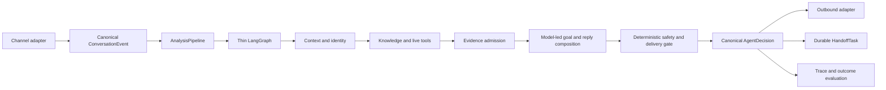

# INHE Customer-Service Copilot Architecture

## Authority

This is the authoritative architecture overview. It describes durable module
ownership and the active delivery direction. Dated acceptance results belong in
evaluation output or historical reports, not in this document.

The system remains a modular monolith. No microservice split, message queue, or
platform-specific Agent fork is currently justified.

## North Star

Build one platform-neutral customer-service Agent that resolves ordinary
customer needs naturally from verified product, order, policy, and media
context; performs approved service actions through tools; and creates a durable
human task when the unresolved part genuinely requires a person.

Quality is measured by customer outcomes:

- correct supported claims;
- completed service actions;
- context continuity across turns;
- low unnecessary-handoff rate;
- zero unsupported high-risk or delivery claims;
- natural, concise, progressive replies; and
- acceptable latency and reliability.

Safety benchmarks and infrastructure checks are necessary constraints. They are
not substitutes for these outcomes.

## Architecture In One Sentence

Use a thin stateful LangGraph runtime around compact context, typed tools,
admitted evidence, one model-first reply owner, and deterministic
safety/delivery control.

LangGraph is not the reasoning engine. The model is not a source of truth. The
knowledge base is not a reply composer.

## Canonical Runtime



The formal customer path is:

```text
canonical turn
-> smallest useful context
-> customer goals
-> identity and tool results
-> admitted evidence plus unresolved claims
-> one customer-facing reply candidate
-> final safety/delivery decision
-> send, assist, or handoff
```

## Layer Ownership

### Channel Adapters

QianNiu, Pinduoduo, JD, and future channels translate native events and
capabilities into canonical contracts. They own platform authentication,
field mapping, outbound formatting, and delivery results. Platform-native
fields may not create branches in Agent reasoning.

Status: planned.

### AnalysisPipeline

`AnalysisPipelineService` is the only formal application path for API, copilot,
replay, and benchmark. It owns stage order, failure isolation, final
persistence, and shadow isolation. HTTP routes own transport and presentation
only.

Status: formal.

### Thin LangGraph Runtime

LangGraph owns state and control flow that benefit from explicit orchestration:

- domain and tool routing;
- bounded retries and timeouts;
- recoverable transitions;
- pause/resume;
- traceable state; and
- choosing reply, clarification, tool, or handoff paths.

It does not own:

- a second evidence registry;
- platform-native fields;
- phrase-specific customer-service rules;
- repeated reply rewriting;
- complete prompt history;
- safety or delivery policy; or
- a second final-response pipeline.

Status: formal but overweight. Reduction is incremental and requires behavior
parity; graph replacement is not a current goal.

### Working Context

The model receives the smallest high-signal context needed for the current
turn:

- current goals and bounded recent turns;
- compact conversation summary when needed;
- resolved product/order identity;
- admitted evidence with provenance;
- unresolved and conflicting claims;
- available tools, service actions, media candidates, and channel capability;
- applicable safety constraints.

Complete traces, unfiltered retrieval stores, all historical answers, private
reasoning, benchmark labels, and entire product catalogs stay outside the
prompt.

Provider-bound and evaluation-bound privacy projection is field-aware.
Structured customer, order, tracking, account, URL, and credential fields are
redacted or pseudonymised before external-model use. Natural-language address
redaction requires an explicit address label, administrative chain, or
road/street plus number; room and usage words such as bedroom, bathroom, living
room, space saving, and moisture questions remain business semantics. Customer-
visible redaction markers remain invalid reply content and fail the final audit.

`answer_eligibility_context/v1` is a diagnostic projection inside the existing
Minimal Decision Context. It preserves, without recomputing, the current
understanding, conversation-reference, tool-requirement, inference-requirement,
and risk-policy verdicts. Missing owner output remains `unknown`. The projection
is not a router, planner, safety gate, or reply owner, and its
`fast_path_preconditions_complete` field does not change execution.

Eligibility counts only canonical `customer_goal` records with a stable
`goal_ref`, canonical claim type, valid understanding status, and source-span
provenance from the current customer message. Compatibility claims synthesized
from `query_fact_type` remain available to legacy retrieval, but are explicitly
degraded and cannot qualify a fast path. Supporting evidence dependencies,
service actions, and contextual constraints are not customer goals.

Phase 1.10.1 qualifies the first conservative eligibility boundary against the
frozen 30-positive/40-negative matrix. SHA-256 provenance uses an exact
field-specific parser; any evidence dependency blocks eligibility; and the
single goal must resolve to exactly one deterministically deduplicated,
goal/attribute/identity-aligned admitted direct fact. These checks remain a
read-only projection. They do not implement Fast Path, invoke a Composer, skip
the graph or final gate, or change the formal reply and `can_send`.

Public `copilot_context` is request data, not owner authority. Conversation
reference and Domain Pack selection enter eligibility only through the
Pipeline's separate, schema-checked internal owner context with explicit source
and provenance. Missing internal owner output stays unknown or missing; client
claims cannot promote it.

### Identity, Knowledge, And Tools

External product references resolve to JST/internal identity before scoped facts
are eligible. Product facts use reviewed knowledge. Order, logistics, promotion,
refund, replacement, and other live state use the appropriate read or action
tool. Media references remain candidates until an actual role-compatible block
is delivered.

Knowledge, policy, service action, media, and Answer Memory are distinct roles.
Presence in a context pack does not authorize a claim.

Tool availability and per-turn tool requirement are also distinct. `ToolSpec`
declares whether a registered tool is static knowledge, a live read, or a
side-effect action. The Tool Router and Executor own whether a turn requires
that tool and whether execution completed. Freshness is deterministic registry
metadata for eligibility; it is not included in LLM Tool Planner metadata or
used to change planner behavior.

### Evidence Admission

`AdmittedAnswerContextService` is the reusable fact-admission boundary. It owns
review status, direct-answer permission, identity scope, claim compatibility,
placeholder rejection, conflict handling, and provenance-preserving
deduplication.

Formal Evidence Convergence is implemented but disabled in production. Enabling
it in an isolated slice does not change the evidence contract.

Domain Policy Packs are versioned data loaded by `FilePolicyRepository` only
from explicit tenant, store, or catalog metadata supplied by trusted deployment
configuration or an explicit internal evaluation fixture. They contain
claim-level risk, inference, direct-fact, and freshness policy, never product
facts, customer text, identities, or reply templates. Deterministic Claim and
Safety owners remain authoritative at runtime. The first
`maternal_child_home` pack is a production candidate only; loading it does not
enable a fast path or alter a formal reply.

### Model-Led Understanding And Reply

The model should understand the current customer goals and organize one natural
reply from compact admitted context. Deterministic code validates schema, tool
authorization, evidence references, safety, and delivery; it should not
reconstruct customer meaning from growing phrase lists.

`ModelFirstAnswerComposerService` is the current candidate reply owner. It is
review-only and disabled by default. It may not retrieve again, establish facts,
execute tools, deliver media, or grant `can_send`.

Its input is partitioned before the model call. Only current-turn,
owner-stamped `customer_goal` items with valid provenance and exactly one Claim
Resolution are renderable. Evidence dependencies remain linked through
`supporting_for_goal_ref`; service actions, media context, and contextual
constraints stay in their own non-factual channels. Missing or unknown goal
kinds, duplicate goal references, invalid provenance, and unbound dependencies
fail closed. The model must return exactly one clause for each renderable
customer goal and no clause for any other partition.

The P0.2d fixed-eight diagnostic qualified this Composer input boundary:
customer-goal clause coverage was 15/15 and no non-customer goal was rendered
as fact. Final and semantic audit gates remained incomplete, so the candidate
stayed review-only and disabled at that stage.

P0-R1 subsequently tested the existing MiniMax-M3 `json_object` transport
without changing Composer semantics. A bounded single-call preflight passed
three representative goal shapes, so no alternative transport was attempted.
The one permitted fixed-eight run reached Composer, Deterministic Final
Contract, and Unified Textual Audit `8/8`, with complete runtime supported and
unresolved coverage and no unknown/duplicate references, unsafe claims,
automatic send, retry, repair, or formal knowledge writes. This qualifies the
feature-disabled Agent Core correctness slice. It does not establish real
conversation quality or authorize production enablement.

P1.2b extended that same disabled path with bounded low-risk inference
metadata, without adding another reasoning service or model call. Its live
gate exposed an ownership error: Claim Resolution required a policy intent
that the four representative turns never nominated, so the safe option
denominator remained zero.

P1.2c keeps the same owners but separates deterministic eligibility from
semantic choice. A trusted Domain Pack defines premise families, qualitative
scope, maximum `low`/`medium` risk, required qualifiers, prohibited claim
families, and mandatory review. Claim Resolution projects every policy in the
safe deterministic intersection as `eligible_policy_options`; a trusted intent
may narrow the set but missing intent does not select or authorize inference.
For each authoritative customer goal, the Composer chooses zero or one offered
policy and returns its policy reference, admitted premise references, and
exact scope with the clause. Deterministic Final checks offered-set
membership, Domain Pack identity and provenance, premises, scope, risk ceiling,
review-only status, qualifiers, prohibitions, and conflicts. Unified Textual
Audit checks the rendered text.

The P1.2c live gate stopped after its first real-derived case, as required.
The provider request returned HTTP 200, the single Composer call was accepted,
both authoritative goals were rendered, the admitted direct fact was
preserved, and deterministic and textual audits passed. The option denominator
was nevertheless `0/0`: the persisted `AdmittedAnswerContext` contained no
bounded inference policies, and both claim resolutions recorded
`bounded_inference_policy_reference_missing`. The earliest observed break is
therefore the trusted Domain Pack owner-context propagation into formal
evidence convergence, not Provider execution or missing policy intent. The
remaining representative cases, the 16-case gate, and synthetic benchmark
were not run. No failed case was retried. The contract remains default-off,
review-only, and not qualified; production reply and `can_send` behavior are
unchanged.

P1.2d keeps Domain Policy in a separate control channel. The Analysis Pipeline
owns one `trusted-domain-policy-context/v1`; it may select only from trusted
deployment configuration, a verified server mapping, or an explicit isolated
evaluation fixture. The context contains an anonymous binding summary plus
Pack reference, schema, canonical content hash, and owner provenance. It never
enters `selected_evidence`, never receives an evidence UID, and cannot support
a fact or change delivery. `FilePolicyRepository` reloads and hash-checks the
Pack before Claim Resolution can expose options. Minimal Decision Context,
Composer, and Deterministic Final preserve and validate the same Pack identity.
Missing, invalid, stale, or public-injected context fails closed to zero
options without suppressing independently admitted direct facts. This remains
a disabled, not-qualified Shadow contract; real-customer accuracy is unproven.

P1.2e preserves that path and separates requested-claim risk from
answer-strategy risk. An absolute-guarantee request remains an unresolved
restricted boundary while Claim Resolution may expose one same-goal,
Pack-backed practical alternative at `low` or `medium` risk. Composer selection
does not change the requested risk; Deterministic Final checks the goal,
premise, policy, scope, risk ceiling, boundary, and Pack hash. High-risk
requests without an eligible restricted boundary, test/liability requests,
and already-supported direct facts cannot acquire this alternative.

The single permitted P1.2e live case proved boundary and risk separation
`1/1`, then failed closed when Composer returned a policy reference outside
the offered set. It was not retried; the remaining representative, Gold, and
Synthetic gates were not run. The candidate remains disabled and not
qualified, with no change to formal reply ownership or `can_send`.

P1.2f narrows the existing Composer input rather than adding a component. A
single pre-call projection assigns deterministic option aliases under each
renderable goal and retains the exact canonical goal/policy/premise/scope/risk
and Pack binding only on the server. Prompt and Validator consume that same
offered projection. The Provider cannot see the complete Domain Pack or
canonical policy identifiers, and Validator performs only exact current-goal
alias lookup. Canonical, unknown, stale, cross-goal, duplicate, and mutated
references fail closed with no retry, repair, or inferred remapping.

The old failure cannot be replayed as an exact Frozen input because its raw
reference and prompt/schema/source hashes were not retained and source changed
after the run. Deterministic and mutation coverage is green, but Frozen 5x and
the business qualification gates remain unrun. The path therefore remains
disabled, review-only, and not qualified.

P1.2h keeps that projection and adds a tri-state completeness rule inside the
same Composer owner. `required` means exactly one model-selected goal-local
option, `optional` means zero or one, and `forbidden` means zero. The
framework re-derives and validates the mode but never chooses an option or
writes reply text. Frozen Composer replay passed `5/5`. The one permitted
fresh full-chain case stopped because Turn Understanding exposed only one of
two current-message goals; the supported direct-fact goal therefore never
reached the Composer projection. No later qualification stage ran, and the
path remains disabled, review-only, and not qualified.

P1.2k.6i preserves the later canonical Decision Input, minimal Composer
output, semantic-budget, Deterministic Final, and Unified Audit v2 engineering
contracts as a disabled checkpoint. This is source-control preservation of
verified owner boundaries, not a new architecture stage or a production
promotion. The formal sequence remains Composer, Deterministic Final, one
Unified Textual Audit, then Delivery Gate.

The application has an independent, default-off Unified Audit role
configuration that can issue exactly one native strict-schema or strict-tool
request through the existing strict transport. It never inherits the
Composer/formal Agent or decision-shadow credentials, and a missing,
unsupported, or unqualified role fails before a model call without fallback.
The transport retains provider-neutral schema and validation ownership while
applying documented wire compatibility at the provider boundary. MiniMax uses
its compatible reasoning and output-budget options; loopback Ollama uses the
native `/api/chat` JSON Schema contract. Neither transport relaxes the local
strict Validator.

P1.4F also corrected an over-restrictive durability policy rather than
training the Auditor to reject useful common sense. `maternal_child_home`
version `1.4.0` permits bounded discussion of impact height, angle, surface,
severity, frequency, and handling pattern plus at most one concise care
suggestion. It still prohibits absolute durability guarantees, test claims,
child-safety claims, warranties, and other unsupported extensions. Under this
reviewed budget, loopback `Qwen3.6:35b` passed the frozen safe/unsafe Audit
matrix `5/5 + 5/5`: it accepted the qualified practical answer and rejected a
true absolute-guarantee/unsafe-use counterexample with stable clause
attribution. This qualifies that exact local Audit role for isolated P1
evaluation only; it does not enable production, Composer, bounded inference,
or `can_send`, and `real_customer_accuracy=null`.

Version `1.5.0` adds the same reviewed control boundary for ordinary cleaning
care and incidental moisture exposure. Both policies require an admitted
material-composition premise, remain `review_only`, and permit only concise
care, spot-test, prompt-drying, ventilation, and splash-versus-immersion
guidance inside declared factor families. They do not establish chemical
compatibility, waterproofing, sterilization, safety, or certification facts.
Claim Resolution does not expose optional policies on an already-supported
goal unless Turn Understanding explicitly nominated that same practical
intent; unresolved goals may still receive the safe offered set for Composer
selection. This keeps useful model reasoning on the actual unresolved goal
without allowing a direct material answer to acquire unrelated care advice.
The existing Composer, Deterministic Final, and Unified Audit chain passed the
cleaning and moisture component matrix `5/5 + 5/5`; full Pipeline qualification
remains pending.

Model portability is role-scoped rather than a global model switch. Turn
Understanding, Composer, Unified Audit, embedding, and VLM roles may evolve at
different rates and must keep separate credentials, model identity,
capability declaration, and qualification evidence. A stronger model receives
the widest compact business context and may perform holistic interpretation,
goal decomposition, option selection, and natural wording. It still cannot
grant itself evidence, action, media, tenant, or delivery authority.

Composer-entry attribution and Composer privacy diagnostics are explicit
evaluation-only sinks and are disabled by default. A missing sink is a
zero-work boundary: no diagnostic observation, traversal, keyed alias, hash,
projection, or emission is performed. Enabling a sink may only add diagnostic
work through the existing server-keyed HMAC/Base32 alias owner; provider
payloads, model/tool/RAG/database call counts, reply state, and `can_send` must
remain identical. These diagnostics have no evidence, reply, audit, routing,
or delivery authority.

The long-term formal path has one semantic reply owner. No-evidence, polishing,
semantic-fit, and final-orchestration services may guard or minimally adapt that
reply, but must not become independent answer engines.

The current feature-disabled model-first candidate implements this ownership
sequence:

```text
Model-first Composer
-> Deterministic Final Contract
-> One Unified Textual Audit
-> Delivery Gate
```

The Composer is the sole candidate reply generator. `FinalAnswerAuditor`
performs the deterministic goal/clause/evidence, canonical-truth, high-risk,
action, media, privacy, and send-prerequisite checks with zero model calls.
`FinalSemanticQualityService` performs the candidate's sole textual LLM audit.
`FinalResponseOrchestrator` owns ordering, state synchronization, and
fail-closed delivery, not reply generation or rewriting.

The legacy production path still has its historical polish and fallback
behavior and is explicitly a compatibility path, not the target ownership
model. Formal Evidence Convergence and the model-first Composer remain disabled
by default. P0 qualification is a reviewable correctness checkpoint, not
production qualification; the active priority is now P1 Gold Conversation
Quality.

### Final Safety And Delivery

Final safety and delivery remain deterministic application responsibilities.
The gate verifies:

- every factual claim has eligible support or allowed bounded inference;
- unresolved high-risk claims remain unresolved;
- service actions correspond to actual tool results;
- media wording matches actual reply blocks;
- channel capability permits delivery; and
- `can_send` reflects the final audited response.

Initial model-first slices remain supervisor-assist only.

### Durable Handoff

A handoff is a task with assignment, reason, SLA, status, acknowledgement, and
audit history. A sentence saying “转人工” is not a handoff implementation.

Status: planned and required before omnichannel automation.

## Active Mainline

ADR 0009 establishes the Agent Core capability mainline. The next deliverable is
one small, real-conversation vertical slice through the existing formal
Pipeline:

1. pinned privacy-safe conversations with usable product/order context;
2. one model-led goal representation;
3. existing identity, retrieval, and tools;
4. existing evidence admission;
5. one model-first reply;
6. existing safety/delivery gate;
7. outcome scoring on correctness, action completion, handoff, naturalness,
   latency, and errors.

This slice is not a production auto-send canary. It exists to prove that the
Agent can answer supported parts, continue a conversation, and escalate only
the unresolved part.

The latest native P1.4 fixed-eight gate reached Composer acceptance `8/8` after
closing Composer input-integrity and option-selection defects. Six cases
reached Delivery; two remained fail-closed at Unified Audit because the current
Provider did not satisfy the frozen audit schema. A separate prospective case
proved that published structured-product material provenance now survives the
formal RAG Repository, Filter, and Evidence Builder path: the material answer
changed from unresolved to supported `PP/TPE`, while unsupported odor and
boiling-water claims stayed unresolved. These are engineering and capability
results only. The candidate remains default-off and review-only,
`can_send=true` remains zero, and real-customer accuracy is still unknown.
The next comparable fixed-eight run must use the qualified loopback Audit role
and Domain Pack `1.5.0`; the historical result remains the Before
baseline until that run completes.

`docs/agent-core-priority-plan.md` is the operational delivery contract for
this mainline. It defines the active priority, stage exit gates, frozen work,
protocol-stabilization budget, and the required architecture-drift check. It
may sequence work within this architecture, but it cannot change module
ownership or production authority without an ADR.

## Frozen Work

Until a failure in the active slice identifies an earlier blocker, do not add:

- supervisor or annotation pages;
- shadow reasoning, memory, vision, or decision modules;
- evaluator/provider qualification frameworks;
- claim taxonomies created to satisfy a small fixture;
- platform-specific Agent rules;
- queues, microservices, or replacement orchestration frameworks.

Existing modules remain available for diagnostics. They do not receive new
scope without a production consumer, promotion metric, rollback boundary, and
real-conversation result.

## Delivery Sequence

### 1. Core Capability Slice

- Establish a comparable baseline on real conversations.
- Ensure required product/order context is present.
- Measure the complete formal Pipeline, not a component in isolation.
- Fix the earliest blocker in context, evidence, tool use, or reply ownership.
- Keep formal knowledge read-only and auto-send disabled.

### 2. Supervisor-Assist Canary

- Expose the qualified candidate to real service staff.
- Record accept, edit, reject, handoff, and handling-time outcomes.
- Promote only when supported-claim correctness and unnecessary handoff improve
  without safety or latency regression.

### 3. Simplify The Runtime

- Remove redundant reply owners after parity tests.
- Collapse Graph nodes that do not own durable state or control flow.
- Retire shadow modules that have no promotion path.

### 4. Omnichannel Operations

- Implement canonical adapters.
- Add durable HandoffTask and supervisor queue.
- Add notifications, SLA, workload, and platform health.

### 5. Low-Risk Automation

- Consider `can_send=true` only for explicitly bounded domains after real
  supervisor-assist evidence, reliable tools, and channel delivery tests.

## Scorecard

Every behavior-affecting change reports:

- real dataset identity and comparable before/after runtime;
- scorable and excluded turns;
- supported-claim correctness and evidence attribution;
- service-action completion;
- unnecessary handoff;
- unsupported high-risk, service, and media claims;
- empty/error/timeout counts;
- reply progression and duplicate replies;
- p50/p95 latency;
- formal knowledge writes; and
- synthetic safety regression.

If real labels are insufficient, report `real_accuracy=null`. Capability metrics
may still be reported, but must not be renamed accuracy.

## Current Reality

- The formal Pipeline, trace/persistence contract, identity boundaries, evidence
  roles, and deterministic safety controls are strong foundations.
- Formal Evidence Convergence and the model-first composer are disabled.
- The canonical answer-eligibility contract is diagnostic only; Fast Path
  remains disabled.
- Public `copilot_context.turn_understanding` is removed before graph
  execution and cannot supply customer goals, reply controls, goal status, or
  fact-type authority. The current server Turn Understanding run replaces
  those fields on every turn, including an explicit empty `requested_claims`
  result.
- Eligibility verifies each customer-goal span against the current normalized
  buyer message and recomputes its digest; shape-valid hashes from another
  message are rejected.
- Real-customer accuracy is not established.
- Existing synthetic benchmark success primarily proves safe fallback.
- Product evidence coverage remains uneven. Published structured-product
  material provenance is now preserved across the formal RAG path, but broader
  attribute and conversation coverage is not yet qualified.
- Reply ownership still overlaps.
- Durable platform adapters and HandoffTask are not implemented.
- Latency is too high for a strong live-service experience.

The project is therefore in **Agent Core capability convergence**, not broad
feature expansion and not production automation.

## Decisions And References

- ADR 0001: one formal AnalysisPipeline.
- ADR 0007: formal evidence convergence.
- ADR 0008: management access boundary.
- ADR 0009: Agent Core capability mainline.
- `docs/langgraph-architecture.md`: runtime-specific boundary.
- `docs/omnichannel-control-plane.md`: platform-neutral operations target.
- `docs/research/mature-customer-service-systems.md`: mature-system patterns.
- `docs/research/evidence-first-llm-decision-loop.md`: evidence/tool/model
  boundary research.
