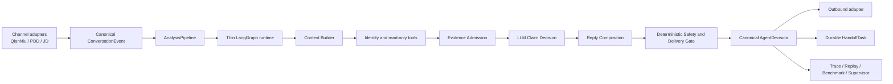

# INHE Customer-Service Copilot Architecture

## Status And Authority

This document is the authoritative system-architecture overview as of
2026-07-15. It describes the current production path, the intended target, and
the order in which the system may converge. Historical delivery reports and
node inventories are implementation evidence, not architecture authority.

The project remains a modular monolith. No microservice split, message queue, or
platform-specific Agent fork is justified until the canonical contracts and one
formal answering path are stable.

## Architecture Decision In One Sentence

Use LangGraph as a thin stateful orchestration runtime; build the answering
ability around compact context, admitted evidence, model-led claim reasoning,
deterministic safety, and durable human handoff.

LangGraph is not the reasoning engine. The LLM is not the source of truth. The
knowledge base is not the reply composer. Each layer has one responsibility.

## Business Goal

The system must support QianNiu, Pinduoduo, JD, and future channels through one
platform-neutral customer-service core. For every customer turn it should:

1. resolve the correct conversation, product, order, and channel capabilities;
2. retrieve the smallest useful set of reviewed facts and live tool results;
3. separate supported, unresolved, conflicting, and prohibited claims;
4. answer supported parts naturally instead of hiding them behind a generic
   handoff;
5. block unsupported high-risk claims and actions;
6. deliver through the channel or create a durable human task;
7. persist enough provenance to reproduce the decision.

## Non-Negotiable Truth Flow

```text
channel event
-> canonical conversation context
-> external identity
-> JST/internal product or order identity
-> reviewed facts, live tool results, policies, or reviewed visual observations
-> evidence admission and conflict handling
-> bounded claim reasoning
-> final safety and delivery decision
-> outbound adapter or durable HandoffTask
```

Product facts, policy facts, service actions, media references, and Answer
Memory are different roles. Presence in a candidate pack never proves that a
claim may be answered.

## Target Architecture



The desired center of gravity is **context-first reasoning**, not graph-node
count. The runtime should expose clear tool and state boundaries while the model
receives only high-signal context for the current claims.

## Layer Responsibilities

### 1. Channel Adapters

Adapters translate platform payloads and capabilities into canonical contracts.
They may not introduce QianNiu-, PDD-, or JD-specific branching into Agent
reasoning. They own authentication, platform field mapping, outbound formatting,
and delivery capability reporting.

Status: planned; QianNiu is the first adapter, not the core.

### 2. AnalysisPipeline

`AnalysisPipelineService` is the only formal application execution path for
`/api/analyze`, `/api/copilot/context`, replay, and benchmark. It owns stage
order and failure isolation:

```text
canonical input
-> graph execution
-> media delivery preparation
-> final orchestration
-> isolated shadow diagnostics
-> final persistence
-> response
```

Routes keep HTTP, authorization, request normalization, metrics, and
presentation only. `AnalysisExecutionService` owns trace lifecycle and final
persistence. A formal stage must not run again after persistence.

Status: formal; ADR 0001.

### Management Access Boundary

Cloudflare Tunnel is transport only. Management-route identity is verified from
Cloudflare Access JWT assertions at the Flask boundary, then mapped through an
explicit endpoint-and-method RBAC registry. The origin does not trust
caller-supplied role or user-name headers, and a verified identity with no
allowlist role is denied rather than becoming an operator. Only the formal
customer analysis POST and feedback POST are customer-runtime entries.
Context/feedback sidecar operations require supervisor or allowlisted service
identity; order, product, SKU, live-query, metric, stats, and feedback-list
routes require verified identity. All unlisted routes are
`default_protected`, not implicitly public. Browser writes also pass a
same-site source check, and development loopback rejects forwarded/Tunnel
request markers.

Status: formal; ADR 0008. This protects the origin even before the external
Cloudflare Access application is configured, because absent configuration fails
management access closed. Public readiness fails closed with redacted reason
codes; public health/version/readiness are liveness-only and
must not expose database or runtime details. Detailed secret-free runtime
diagnostics are `admin_only`. Security audit records use a keyed pseudonymous actor
identifier rather than raw identity claims.

### 3. Thin LangGraph Runtime

LangGraph should retain only work that benefits from explicit state and control
flow:

- conversation state transitions;
- identity and tool routing;
- bounded retries and timeouts;
- pause/resume for human approval;
- recoverable execution and traceable node boundaries;
- selection between product, order, policy, clarification, and handoff flows.

LangGraph should not become the owner of:

- duplicate fact, risk, or evidence registries;
- platform-native fields;
- repeated reply polishing;
- phrase-specific business rules;
- large prompt payloads or complete traces;
- a second final-response pipeline.

The current graph contains overlapping understanding, routing, guard, and
generation responsibilities. It must be reduced incrementally after contract
tests exist; a big-bang rewrite is prohibited. See
`docs/langgraph-architecture.md` for the runtime boundary and current debt.

Status: formal but overweight.

### 4. Context Builder

The Context Builder is the working-memory boundary for the model. A decision
context should contain only:

- current customer goal and requested claims;
- necessary recent turns plus a compact conversation summary;
- resolved product and order identity;
- admitted evidence with stable evidence UIDs and provenance;
- unresolved and conflicting claims;
- available service actions and media candidates, explicitly labelled as
  non-factual roles;
- allowed tools and channel capabilities;
- applicable safety constraints.

It must not contain the complete trace, all retrieved chunks, unfiltered Answer
Memory, entire product catalogs, or every historical rule. Context size and
source counts must be observable.

Status: converging. `AdmittedAnswerContextService` is the admission reuse point.
When `COPILOT_FORMAL_EVIDENCE_CONVERGENCE_ENABLED` is enabled, the existing
evidence-builder node emits deterministic admitted-only `selected_evidence` and
a bounded decision context; the final delivery contract remains unchanged.

### 5. Identity, Retrieval, And Tools

External titles resolve through JST/internal identity before product-scoped
facts are selected. Order, logistics, refund, replacement, and other live-state
claims require the relevant live tool or approved policy source.

Retrieval returns candidates. Admission decides eligibility. Tools return typed
results rather than customer-facing prose. A tool set should be small,
non-overlapping, and understandable to the model.

Status: SQLite retrieval and JST paths are formal; pgvector remains shadow.

### 6. Evidence Admission

One versioned contract must decide whether evidence may support a claim. Direct
product evidence requires:

- reviewed, approved, verified, or published state;
- direct-answer permission and an eligible evidence role;
- matching identity in at least one shared namespace;
- compatible requested fact type or attribute;
- no unresolved conflict or placeholder status.

`service_action`, `fallback_only`, `media_reference`, Answer Memory, rejected
visual observations, and unreviewed FAQ cannot become product facts.

Status: shared admission exists. Formal convergence is opt-in behind
`COPILOT_FORMAL_EVIDENCE_CONVERGENCE_ENABLED`; it reuses admission rather than
creating a second evidence registry and does not alter final delivery.

### 7. LLM Claim Decision And Reply Composition

The model should understand compound questions, select bounded read-only tools,
associate evidence with individual claims, and compose natural replies. It must
return a structured decision rather than private chain-of-thought:

- requested claims;
- evidence UIDs used for each confirmed claim;
- unresolved or conflicting claims;
- requested human action;
- candidate reply;
- concise decision reason codes.

Supported claims should be answered even when another claim is unresolved. The
model may connect verified facts only through declared low-risk reasoning. It
may not derive toxicity, certification, age suitability, load limits, order
status, refunds, replacements, compensation, or installation-safety promises
without the required evidence or tool result.

Status: Grounded Reasoning and the Evidence-First Decision Loop are shadow-only.
The strict provider is not qualified for formal use. The formal path still
leans on deterministic rendering and broad handoff fallback.

### 8. Deterministic Safety And Delivery

The final gate verifies claim support, product identity, high-risk policy,
actual media blocks, platform capability, and delivery status. It alone may set
the final `can_send` and `requires_human_review` contract.

Safety should inspect the final answer once. A fallback may replace an unsafe
reply, but resolved pre-fallback failures must not contaminate the final audit.
Polishing may improve customer-facing language but cannot add facts, promises,
media, or actions.

Status: formal and intentionally conservative; currently stronger than reply
composition.

### 9. Human Handoff And Supervisor Control Plane

A handoff is a durable task with shop, channel, conversation, reason, evidence,
priority, SLA, assignment, acknowledgement, status, and audit history. A toast
or customer-facing sentence is not a handoff task.

Status: planned/P1. The absence of this layer blocks true omnichannel operation.

### 10. Data, Evaluation, And Operations

Replay and benchmark must use the same canonical context and final Pipeline as
user-facing requests. Benchmark pass rate is not production readiness when all
cases are review-only or real samples lack sidecar context.

Real accuracy evaluation is a separate read-only Gold Set contract. It parses
reviewed HTML conversations into de-identified role turns using stable source
DOM direction metadata before text prefixes, requires an
independent output privacy scan before any label or baseline operation, keeps
reference labels outside the Agent payload, and stores human claim labels in a
separate evaluation database. Fewer than 30 independently structured approved
claim labels remains an insufficient baseline rather than a project accuracy
result. Its coverage
matrix records where real queries lose context or admitted evidence; it does
not activate Formal Evidence Convergence or change the formal response path.

SQLite currently mixes knowledge, operations, traces, evaluation, and memory.
Web and resident workers also share process ownership. These are later runtime
separation tasks, not reasons to split the domain into microservices now.

The runtime exposes liveness separately from readiness. Liveness confirms that
the Flask process can serve diagnostics. Readiness verifies the configured
formal knowledge database through read-only SQLite access, including required
tables and non-empty knowledge, chunk, and KBQA counts. Product-scoped analysis
fails closed before graph execution when readiness is false; formal QA performs
the same preflight and does not manufacture a RAG-miss evaluation run.

## Formal, Shadow, And Planned Boundaries

| Capability | Status | May affect final reply or `can_send` |
|---|---|---|
| AnalysisPipeline and final orchestration | formal | yes, through final contract |
| SQLite retrieval, identity and eligible tools | formal | yes, after admission |
| Final audit and delivery gate | formal | yes |
| pgvector retrieval | shadow | no |
| Answer Memory | shadow/reference | no; style and handling only |
| Grounded Reasoning Draft | shadow | no |
| Product Media Observation and annotation | shadow | no |
| Evidence-First Decision Proposal | shadow/qualification-gated | no |
| Platform adapters and durable HandoffTask | planned | not implemented |

Shadow modules may write diagnostics only. They must freeze formal decision
fields and pass an explicit promotion gate before joining production decisions.

## Current Architecture Assessment

### Current Phase: 0.8D Gold-30 Approval Gate

Formal Evidence Convergence is implemented as an opt-in, fail-closed contract,
but its production flag remains disabled. Phase 0.8C repaired the proven
metadata-loss boundary between Product Context Pack and formal admission,
validated 15/15 query-only real-derived facts plus seven negative controls, and
closed the isolated 5012 delivery gate. The 1x1 probe set and 5-product by
3-question slice now keep non-factual media/action candidates out of selected
evidence and actual media blocks. This is not a new Graph, registry, or reply
owner, and it is not a real-customer accuracy claim.

Phase 0.8D has produced a privacy-checked, deterministic 30-claim supervisor
queue across seven structured business domains. The queue satisfies the
multi-turn, partial-answer, high-risk/handoff, service-action, and per-domain
caps, but it is not Gold truth: the independent label store currently contains
zero supervisor-approved claims and zero approval audit events. Tier A therefore
fails closed before calling the Agent, and real-customer accuracy remains
`null`. The review route exists in this source tree at
`/ask/real-accuracy-labels`, but the pinned 5011 runtime still serves the older
`17b82bb1` build and currently returns 404 for that route. The next action is an
approved workbench deployment followed by human review, not a reply-policy
change or an in-place 5011 restart.

### What Is Strong

- One formal Pipeline is shared by API, copilot, replay, and benchmark.
- Final response, snapshot, and trace contracts are aligned.
- Product identity, evidence roles, media delivery, and high-risk boundaries are
  explicit and fail closed.
- Replay, benchmark, provider qualification, visual review, and shadow mutation
  guards provide useful observability.
- The modular-monolith decision avoids premature distributed-system overhead.

### What Is Blocking Business Value

1. Formal Evidence Convergence is available but intentionally disabled. Its
   offline and isolated API capability gates pass, but approved Gold/Tier A and
   a separately authorised production canary decision are still required before
   changing the 5011 flag.
2. The public supervisor workbench is blocked until Cloudflare Tunnel has a
   healthy connector and the real Access/RBAC path can be exercised.
3. The Gold-30 review queue is ready, but Tier A has zero approved claims and
   zero approved domains; its accuracy rate must remain `null`, not be inferred
   from benchmark or shadow results.
4. Context construction is fragmented across graph state, packs, policies, and
   shadow payloads.
5. Multiple guard, fallback, semantic, and polishing services can rewrite the
   same response and produce robotic handoff language.
6. Visual understanding, Answer Memory, pgvector, and LLM decision capabilities
   have accumulated in shadow without a promoted vertical slice.
7. Real replay often lacks per-sample product/order context.
8. Durable handoff and platform adapter contracts are not implemented.

The primary risk is now **shadow accumulation**, not lack of experimental
capability. New shadow subsystems should be frozen unless they unblock the next
formal vertical slice.

## Convergence Plan

### Phase A: Formal Evidence Convergence (Implemented, Flag Disabled)

- merge eligible Product Context Pack facts into one canonical selected/admitted
  evidence contract;
- keep role, identity, review, conflict, and provenance checks fail closed;
- verify the same result across API, replay, benchmark, trace, and snapshot.

The implementation remains behind
`COPILOT_FORMAL_EVIDENCE_CONVERGENCE_ENABLED=false` in the current runtime.
Its promotion requires the Gold approval and Tier A gates described above; it
is not a substitute for them.

#### Material Field Governance

Material composition has an additional field-level admission rule. A published
product is not, by itself, evidence that its material field was verified.
Direct composition evidence must retain explicit field provenance, direct
permission, reviewed status, a matching product identity, and a composition-
only value. Placeholder values, untrusted provenance, mixed safety or
compliance wording, identity failures, and same-slot conflicts are rejected
before canonical selection. Material names never imply toxicity, food-contact
status, odour, cleaning, moisture resistance, certification, or child safety.

Material remediation is supervisor staging, not a formal KB batch update. The
staging plan groups pseudonymous entries by reusable source, review, scope, and
claim characteristics; decisions are optimistic-lock audit records and cannot
change formal facts or `can_send`. A real-derived, HMAC-only material Shadow QA
may preview confirmed composition plus unresolved high-risk subclaims, but it
does not modify the formal reply or delivery contract.

Material answer quality may be validated without a manual scoring step. The
gold-customer-service evaluator independently checks supported-fact coverage,
claim separation, immediate risk handling, natural copy, unsupported promises,
and delivery safety, then proves the rubric with negative mutations. This
automated verdict evaluates answer behaviour only: it cannot verify a source,
approve a product fact, write formal knowledge, or change `can_send`. Formal
runtime validation must be reported separately from deterministic Shadow copy
so a template cannot grade itself as production-ready.

### Phase B: Context-First Supervised Partial Answer

- build the minimal Decision Context;
- split compound questions into claim-level supported/unresolved/conflicting
  states;
- answer confirmed claims and defer only unresolved claims;
- expose the candidate to supervisors first with `can_send=false`;
- qualify a strict provider before model output can affect formal decisions.

The first Phase B slice is a deterministic supervisor preview. It consumes only
the Minimal Decision Context, preserves claim-level evidence references, and
always remains review-only; it cannot update the formal reply, delivery blocks,
or `can_send`.

Phase 0.8A adds one canonical role-aware conversation-turn contract at the
Pipeline boundary. API, copilot, replay, Gold baseline, benchmark, and Tier D
normalize a bounded list of `{role, content, turn_uid, turn_index}` records
before understanding. Evaluation callers fail closed on malformed history;
ordinary legacy callers are explicitly marked `degraded_context` rather than
silently treating a concatenated transcript as usable conversation state. The
current customer message is separate from prior turns and is not duplicated in
the model context. Pipeline revalidation preserves the earliest upstream
`degraded` or `invalid` reason instead of replacing it with `valid` after an
empty-list normalization.

A review-only model-led candidate may compose an already resolved set of
supported and pending clauses from this compact context. It receives neither a
full trace nor a candidate store, and its text must preserve every precomputed
clause and pass the existing isolated audit before it is shown to a supervisor.
It cannot select facts, change delivery, or become a formal reply. Structured
action selection remains blocked until the strict decision provider qualifies.

Phase B evaluation runs Claim Resolution from raw requested claims and admitted
facts rather than accepting precomputed resolutions. Attribute-qualified claims
select only compatible evidence and conflicts. A preview fails closed when its
isolated final-audit or semantic-fit diagnostic fails, and synthetic success is
not treated as a real positive-evidence promotion result.

### Phase C: Simplify The Runtime

- inventory duplicate understanding, routing, guard, and reply-rewrite nodes;
- consolidate only after behavior and trace equivalence tests exist;
- keep a small set of macro graph stages and move reusable contracts into one
  tested owner each;
- do not rewrite the graph and the answering contract in the same change.

### Phase D: Omnichannel Operations

- implement canonical platform ports;
- add durable HandoffTask, assignment, SLA, acknowledgement, and audit;
- connect QianNiu first, then PDD and JD without changing Agent-domain logic.

### Phase E: Runtime And Data Separation

- separate web and workers;
- introduce managed migrations and CI enforcement;
- separate operational and analytical workloads when measured contention or
  deployment needs justify it.

## Anti-Drift Rules

Before changing architecture or adding a module:

1. identify the earliest broken contract and its current owner;
2. verify whether a maintained tool or existing project service already solves
   it;
3. avoid new policy, fallback, shadow, or index modules when an owner exists;
4. declare the capability `formal`, `shadow`, `legacy`, or `planned`;
5. state whether it changes evidence eligibility, final reply, `can_send`, media
   delivery, or handoff;
6. test API, copilot, replay, benchmark, trace, and persistence where relevant;
7. update this overview only for durable responsibility or data-flow changes;
8. record production ownership changes in an ADR before implementation.

## Formal Delivery Fail-Closed

The formal path treats requested claims independently. A supported material
composition clause does not imply a material-safety, certification, child, or
performance conclusion. Any unresolved requested high-risk claim remains
human-review-only even when another low-risk claim is supported.

With explicit Evidence Convergence opt-in, final orchestration can render a
constrained partial answer from the same admitted claim resolutions: supported
clauses appear first with provenance, then unresolved or conflicting clauses
stay review-only. This remains `can_send=false` with an empty sendable reply.
A later customer-language or semantic fallback must preserve supported clauses
and re-run final audit, semantic fit, claim support, and delivery checks; it
cannot replace confirmed facts with a generic handoff.

Material composition is not a product-specific care, moisture, safety,
toxicity, certification, or food-grade fact. Cleaning and moisture instructions
need separately reviewed, direct, identity-matched evidence with a compatible
claim and attribute. For accidental bite or ingestion, deterministic immediate
action is to stop use/contact and seek medical advice for swallowing or
symptoms; the system does not diagnose or infer non-toxicity from composition.

Published product status is not sufficient field provenance. A structured
material value whose field source remains `conservative_placeholder`, or whose
value mixes composition with a strong claim such as food-grade or environmental
compliance, is not eligible for direct structured evidence. Governance must
verify or split that field before it can support a customer-facing claim.

Visual delivery is fact-type scoped. Dimensions and space-fit delivery may use
only an actual reply block built from an identity-matched dimension reference;
an appearance or SKU image is not promoted by title text, retrieval score, or
an answer scenario label. This boundary is enforced before final delivery and
does not change the shadow decision layers.

## External Design References

- Anthropic, *Building effective agents*: prefer simple composable patterns and
  add complexity only when evaluation demonstrates value.
  https://www.anthropic.com/engineering/building-effective-agents
- Anthropic, *Effective context engineering for AI agents*: treat context as a
  finite resource and provide the smallest high-signal set of instructions,
  tools, history, and external data.
  https://www.anthropic.com/engineering/effective-context-engineering-for-ai-agents
- LangGraph overview: use the runtime for durable execution, persistence,
  streaming, and human-in-the-loop rather than as a replacement for model and
  tool design.
  https://docs.langchain.com/oss/python/langgraph/overview

These references support the target direction; project business invariants and
verified code behavior remain authoritative.

## Phase 0.8A Context Integrity

Canonical turns preserve formal local text for structured identity and
read-only tools. A separate privacy projection removes inline phone, address,
and order-reference text before an external-model call, trace, or evaluation
artifact. Online callers retain input order and record narrow index repairs;
strict evaluators reject missing, duplicate, or descending turn indexes before
Graph execution. Sidecar history remains structured and is never concatenated
into the current customer message.

The external-model projection is field-aware. It handles plain text, embedded
or fenced JSON, repeated JSON blocks, and labelled identifier lines without
repairing malformed JSON. It preserves product titles, categories, admitted
fact values, and ordinary room-use wording while replacing buyer identifiers,
addresses, order/logistics references, credentials, and structured product
identifiers with non-reversible references. It is a provider-boundary safeguard,
not a replacement for structured privacy projection before JSON serialization.
Runtime version metadata freezes the process boot commit, source-tree hash,
worktree state, model, and flags, then separately reports current disk hash and
source drift. Tier D rejects a drifted runtime and is invalid when its independent
strict-schema grader is unqualified; simulator observations and internal action
events remain diagnostics and cannot credit customer-visible action coverage.
The grader distinguishes a `configured_candidate` from one qualified for live
evaluation: a configured candidate may run the read-only positive/negative
semantic matrix with explicit unqualified access, but the 9x2 runner requires
an explicit human-approved qualification flag. A successful probe never writes
that flag or changes runtime configuration.

Tier D also has a pre-trial provider-independence gate. The formal Agent,
customer simulator, and transcript grader each expose only a host fingerprint
and model identity; missing identity or an exact pairwise match fails closed
before any dataset or Agent call. The same model on different hosts remains a
recorded independence risk rather than an identity collision. The fingerprint
uses only a canonical origin (scheme, lower-case host, and effective port), so
paths, queries, fragments, and userinfo cannot bypass an otherwise identical
provider identity. Qualification records one safe result per strict call and
counts timeout, truncation, schema, and free-text failures from those attempts;
only successful calls contribute latency percentiles.

### Phase 0.8A.6 Tier D evaluation integrity

Tier D projects every formal response once into a minimal
`tier-d-turn-observation/v1`. Deterministic scoring, transcript grading,
checkpoint persistence, the final report, and offline recomputation consume
that same projection. It contains the customer-visible reply, delivery state,
actual media-block counts, pseudonymous selected-evidence summaries, final
audits, and Pipeline version; it excludes raw trace, endpoints, credentials,
orders, and source identities. A report is invalid when offline recomputation
does not reproduce its stored blocking reasons.

The evaluator has its own source identity, independent of the HTTP runtime
identity. A dirty evaluator requires an exact expected source hash, records
boot/end hashes and qualification/dataset hashes, and fails on drift. Known
SHA-256 fields retain their complete typed value; arbitrary text does not gain
a privacy exemption merely because it resembles a long identifier. Source
linkage uses the HMAC case reference plus a complete canonical-conversation
digest, so shared target-turn fingerprints do not silently select the first
record. Checkpoints are replaced atomically.

Both the transcript grader and buyer simulator must pass serial and concurrent
long-context qualification before a trial. The formal Agent provider also
receives a credential/quota/identity-bound readiness probe through the same
formal transport adapter used by generation before the dataset is opened. A
strict simulator response that passes Provider schema validation but violates
the local state-machine contract may be requested once more; transport,
timeout, truncation, and schema failures are never retried here.

The isolated MiniMax M3 candidate completed the fixed 9x2 run with all nine
sources resolved, 18/18 trials persisted, zero simulator errors, no source or
evaluator drift, and a checkpoint identical to the report after failure
classification. This is a valid exploratory baseline, not a production model
cutover or real-customer accuracy result. It exposed zero selected-evidence
turns, 75 percent mean action coverage, 44 percent consecutive-reply
repetition, and 0/18 overall exploratory passes while all 68 formal turns
remained non-sendable and required human review.

## Phase 0.8B.1 Evidence Funnel And Evaluation Stop-Loss

Phase 0.8B does not add a Graph node, retrieval path, evidence registry, safety
gate, or formal reply owner. `AdmittedAnswerContextService` projects its
existing candidate/admission result into a content-free turn evidence funnel
with one deterministic earliest breakpoint. The fixed nine-scenario capture
contains 68 turns: 37 stop at `source_coverage_gap`, 31 at
`evidence_role_ineligible`, and none reach formal selected evidence.

The formal path remains unchanged. Formal Evidence Convergence stays disabled.
Evidence Action, Dialogue State, and counterfactual preview are
`paused_not_qualified`; Pipeline does not invoke them, and runtime ignores a
stale Action enablement flag. The report-safe funnel contains counts, roles,
fact/attribute types, identity namespaces, and pseudonymous UIDs only.

## Phase 0.8C Real Evidence Vertical Slice

The 68-turn funnel is now classified without reading buyer wording into business
rules. Of 31 role-ineligible turns, 23 lost an explicit structured-field protocol
during Product Context Pack compaction, seven are unsafe high-risk promotion
candidates, and one is a correctly rejected non-fact. Of 37 source gaps, 13 lack
sidecar context and 24 require order or other live-state verification.

The earliest production fix preserves explicit field review, direct-answer,
identity, attribute, and provenance metadata while compacting a Pack fact. It
does not grant a role from a table name, source type, product publication state,
or text keyword. `AdmittedAnswerContextService` remains the sole admission
owner. A query-only inventory found 393 products with at least one eligible fact
and 428 eligible facts. The deterministic fixture selected 12 products and 15
facts across three fact types, then passed all seven negative controls without
formal knowledge writes. Only two selected dimension facts were available and
their canonical attribute slots remain missing, so this is not broad dimension
coverage.

The isolated API comparison confirmed that enabling the flag moves eligible
facts into canonical selected and admitted evidence. Duplicate Product Context
Pack and profile-builder copies now share structured provenance and converge to
one formal fact. A broad `dimensions` fact type is not treated as an attribute
slot when the structured source exposes no width/height/etc. slot.

The non-sendable 1x1 gate passed all three probes. The subsequent 5x3 slice
passed 15/15: low-risk facts were supported, mixed low/high-risk questions kept
supported facts plus unresolved claims, and media/service-only questions had
zero selected facts and zero image/video blocks. Every result remained
review-only, protected database counts were unchanged, and the synthetic safety
benchmark remained 5/5 and 22/22. Formal Evidence Convergence therefore remains
disabled on 5011 pending an explicit canary decision, Evidence Action remains
paused, and real customer accuracy remains `null`.

Tier D is reduced to canonical conversation, the formal Agent, deterministic
turn checks, and at most one transcript semantic grader call per trial. Without
a qualified grader, semantic action coverage and overall pass are null. The
MiniMax M2.7-highspeed buyer candidate failed both strict-schema and tool-call
short/long qualification with zero successful attempts, so 1x1, 3x1, grader
qualification, and 9x2 were not started. This is an evaluator-provider blocker,
not an Agent accuracy result.
