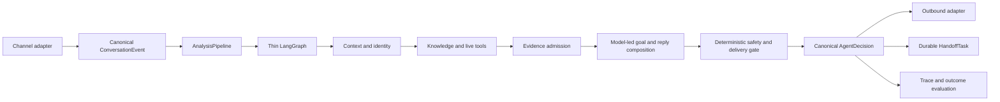

# INHE Customer-Service Copilot Architecture

## Authority

This is the authoritative architecture overview. It describes durable module
ownership and the active delivery direction. Dated acceptance results belong in
evaluation output or historical reports, not in this document.

The system remains a modular monolith. No microservice split, message queue, or
platform-specific Agent fork is currently justified.

## North Star

Build one platform-neutral customer-service Agent that resolves ordinary
customer needs naturally from verified product, order, policy, and media
context; performs approved service actions through tools; and creates a durable
human task when the unresolved part genuinely requires a person.

Quality is measured by customer outcomes:

- correct supported claims;
- completed service actions;
- context continuity across turns;
- low unnecessary-handoff rate;
- zero unsupported high-risk or delivery claims;
- natural, concise, progressive replies; and
- acceptable latency and reliability.

Safety benchmarks and infrastructure checks are necessary constraints. They are
not substitutes for these outcomes.

## Architecture In One Sentence

Use a thin stateful LangGraph runtime around compact context, typed tools,
admitted evidence, one model-first reply owner, and deterministic
safety/delivery control.

LangGraph is not the reasoning engine. The model is not a source of truth. The
knowledge base is not a reply composer.

## Canonical Runtime



The formal customer path is:

```text
canonical turn
-> smallest useful context
-> customer goals
-> identity and tool results
-> admitted evidence plus unresolved claims
-> one customer-facing reply candidate
-> final safety/delivery decision
-> send, assist, or handoff
```

## Layer Ownership

### Channel Adapters

QianNiu, Pinduoduo, JD, and future channels translate native events and
capabilities into canonical contracts. They own platform authentication,
field mapping, outbound formatting, and delivery results. Platform-native
fields may not create branches in Agent reasoning.

Status: planned.

### AnalysisPipeline

`AnalysisPipelineService` is the only formal application path for API, copilot,
replay, and benchmark. It owns stage order, failure isolation, final
persistence, and shadow isolation. HTTP routes own transport and presentation
only.

Status: formal.

### Thin LangGraph Runtime

LangGraph owns state and control flow that benefit from explicit orchestration:

- domain and tool routing;
- bounded retries and timeouts;
- recoverable transitions;
- pause/resume;
- traceable state; and
- choosing reply, clarification, tool, or handoff paths.

It does not own:

- a second evidence registry;
- platform-native fields;
- phrase-specific customer-service rules;
- repeated reply rewriting;
- complete prompt history;
- safety or delivery policy; or
- a second final-response pipeline.

Status: formal but overweight. Reduction is incremental and requires behavior
parity; graph replacement is not a current goal.

### Working Context

The model receives the smallest high-signal context needed for the current
turn:

- current goals and bounded recent turns;
- compact conversation summary when needed;
- resolved product/order identity;
- admitted evidence with provenance;
- unresolved and conflicting claims;
- available tools, service actions, media candidates, and channel capability;
- applicable safety constraints.

Complete traces, unfiltered retrieval stores, all historical answers, private
reasoning, benchmark labels, and entire product catalogs stay outside the
prompt.

Provider-bound and evaluation-bound privacy projection is field-aware.
Structured customer, order, tracking, account, URL, and credential fields are
redacted or pseudonymised before external-model use. Natural-language address
redaction requires an explicit address label, administrative chain, or
road/street plus number; room and usage words such as bedroom, bathroom, living
room, space saving, and moisture questions remain business semantics. Customer-
visible redaction markers remain invalid reply content and fail the final audit.

`answer_eligibility_context/v1` is a diagnostic projection inside the existing
Minimal Decision Context. It preserves, without recomputing, the current
understanding, conversation-reference, tool-requirement, inference-requirement,
and risk-policy verdicts. Missing owner output remains `unknown`. The projection
is not a router, planner, safety gate, or reply owner, and its
`fast_path_preconditions_complete` field does not change execution.

Eligibility counts only canonical `customer_goal` records with a stable
`goal_ref`, canonical claim type, valid understanding status, and source-span
provenance from the current customer message. Compatibility claims synthesized
from `query_fact_type` remain available to legacy retrieval, but are explicitly
degraded and cannot qualify a fast path. Supporting evidence dependencies,
service actions, and contextual constraints are not customer goals.

Phase 1.10.1 qualifies the first conservative eligibility boundary against the
frozen 30-positive/40-negative matrix. SHA-256 provenance uses an exact
field-specific parser; any evidence dependency blocks eligibility; and the
single goal must resolve to exactly one deterministically deduplicated,
goal/attribute/identity-aligned admitted direct fact. These checks remain a
read-only projection. They do not implement Fast Path, invoke a Composer, skip
the graph or final gate, or change the formal reply and `can_send`.

Public `copilot_context` is request data, not owner authority. Conversation
reference and Domain Pack selection enter eligibility only through the
Pipeline's separate, schema-checked internal owner context with explicit source
and provenance. Missing internal owner output stays unknown or missing; client
claims cannot promote it.

For a resolved product request, the Pipeline may derive that internal context
from one exact SKU or `i_id` cross-checked against one published `KBProduct`.
The product's reviewed `domain_policy_id` is control metadata only: it is not
evidence, a product fact, an evidence UID, or model-visible Pack content. Title
matching, ambiguous identifiers, unpublished products, a blank mapping, and
public tenant/store/catalog values all fail closed to a missing Pack. Changing
the mapping on a published product returns it to the existing product review
workflow before it can be used. A query-only legacy catalog that predates this
optional control column remains readable but is treated as unbound until its
normal writable migration completes.

### Identity, Knowledge, And Tools

External product references resolve to JST/internal identity before scoped facts
are eligible. Product facts use reviewed knowledge. Order, logistics, promotion,
refund, replacement, and other live state use the appropriate read or action
tool. Media references remain candidates until an actual role-compatible block
is delivered.

The existing Product Data Hub may be consulted through its read-only v2 API as
an optional identity directory. The adapter accepts only exact product or SKU
codes, verifies that both identifiers resolve to the same active parent, and
projects only identity/display metadata into `ProductContextPackService` as
`reference_only`. Hub notes, free-form SKU attributes, image labels, and its
keyword-based customer-service endpoint are excluded. A Hub result cannot enter
`facts`, canonical `selected_evidence`, the Composer's factual premise set, or
Delivery. Reviewed formal knowledge remains the only product-fact authority.
The integration is disabled by default and fails closed on missing, ambiguous,
conflicting, malformed, or unavailable catalog data.

Channel context keeps store identity platform-neutral. `shop_id` identifies the
logical integrated store used by the Agent and future channel adapters; it is
not implicitly a JST provider identifier. An adapter may additionally provide
an explicit `jst_shop_id` when the JST API must be provider-scoped. A sidebar
platform trade identifier is resolved through the read-only order tool before
product answering, so the resulting internal product name, SKU, `i_id`, order
state, and logistics identity can seed the same canonical turn without title
guessing. Independently integrated stores therefore remain separated without
coupling Agent reasoning to JST-specific IDs.

The read-only JST fallback scans every page returned for the current provider
window and stops only on an exact identifier match, the provider's reported
last page, or an explicit pagination-integrity failure. It matches exact order-
and item-level external identifiers and carries an explicit `jst_shop_id`
through the fallback scan. A repeated full page is treated as
`pagination_stalled`, not as a completed lookup miss. This does not imply that
every platform identifier is visible to the ordinary JST order-detail API.
For Taobao/Tmall customer-service identity, the read-only dispatcher first uses
the ordinary JST sales-outbound endpoint `orders/out/simple/query` with the
exact sidebar online order number in `so_ids` and the provider-scoped
`jst_shop_id`. This account-qualified route returns non-sensitive outbound
state, logistics identity and item `sku_id`/`i_id`/internal name without buyer
or receiver data. It does not require Qimen. An order that has not produced a
sales-outbound record remains unresolved rather than being guessed from another
store or product title. The resulting SKU/product identity can select reviewed
formal product facts, but the outbound payload itself does not become product-
fact authority. A completed empty lookup is carried to the existing Composer as
non-factual service-action guidance: it may say that the lookup completed and
that no outbound/logistics record is currently visible, but it may not infer
that the order does not exist or ask for an order identifier already present in
canonical sidebar context. Incomplete or errored lookups remain fail-closed.

Knowledge, policy, service action, media, and Answer Memory are distinct roles.
Presence in a context pack does not authorize a claim.

Tool availability and per-turn tool requirement are also distinct. `ToolSpec`
declares whether a registered tool is static knowledge, a live read, or a
side-effect action. The Tool Router and Executor own whether a turn requires
that tool and whether execution completed. Freshness is deterministic registry
metadata for eligibility; it is not included in LLM Tool Planner metadata or
used to change planner behavior.

### Evidence Admission

`AdmittedAnswerContextService` is the reusable fact-admission boundary. It owns
review status, direct-answer permission, identity scope, claim compatibility,
placeholder rejection, conflict handling, and provenance-preserving
deduplication.

Completed read-only order and logistics tool results may enter that boundary as
`operational_fact_direct`. They remain separate from reviewed product facts and
must carry a completed execution status, a closed `order` or `logistics` scope,
direct-answer permission, and compatible claim type. Planned or failed tools,
service actions, media references, placeholders, and write-capable operations
remain non-factual and cannot enter canonical `selected_evidence`. Operational
fact admission adds no delivery authority: Supervisor Assist remains
`can_send=false` and requires human review.

Formal Evidence Convergence is implemented but disabled in production. Enabling
it in an isolated slice does not change the evidence contract.

Domain Policy Packs are versioned data loaded by `FilePolicyRepository` only
from trusted deployment configuration, a Pipeline-verified published-product
mapping, or an explicit internal evaluation fixture. They contain
claim-level risk, inference, direct-fact, and freshness policy, never product
facts, customer text, identities, or reply templates. Deterministic Claim and
Safety owners remain authoritative at runtime. The first
`maternal_child_home` pack is a production candidate only; loading it does not
enable a fast path or alter a formal reply.

### Model-Led Understanding And Reply

The model should understand the current customer goals and organize one natural
reply from compact admitted context. Deterministic code validates schema, tool
authorization, evidence references, safety, and delivery; it should not
reconstruct customer meaning from growing phrase lists.

`ModelFirstAnswerComposerService` is the current candidate reply owner. It is
review-only and disabled by default. It may not retrieve again, establish facts,
execute tools, deliver media, or grant `can_send`.

Its input is partitioned before the model call. Only current-turn,
owner-stamped `customer_goal` items with valid provenance and exactly one Claim
Resolution are renderable. Evidence dependencies remain linked through
`supporting_for_goal_ref`; service actions, media context, and contextual
constraints stay in their own non-factual channels. Missing or unknown goal
kinds, duplicate goal references, invalid provenance, and unbound dependencies
fail closed. The model must return exactly one clause for each renderable
customer goal and no clause for any other partition.

The Composer uses the formal LLM by default. A deployment may instead supply a
complete, separately qualified COPILOT_COMPOSER_LLM role override. This changes
only reply composition: it does not change Understanding, routing, retrieval,
evidence admission, Audit, safety, delivery, or can_send. An incomplete or
unqualified override blocks the candidate before any Provider call rather than
falling back to a different model.

The P0.2d fixed-eight diagnostic qualified this Composer input boundary:
customer-goal clause coverage was 15/15 and no non-customer goal was rendered
as fact. Final and semantic audit gates remained incomplete, so the candidate
stayed review-only and disabled at that stage.

P0-R1 subsequently tested the existing MiniMax-M3 `json_object` transport
without changing Composer semantics. A bounded single-call preflight passed
three representative goal shapes, so no alternative transport was attempted.
The one permitted fixed-eight run reached Composer, Deterministic Final
Contract, and Unified Textual Audit `8/8`, with complete runtime supported and
unresolved coverage and no unknown/duplicate references, unsafe claims,
automatic send, retry, repair, or formal knowledge writes. This qualifies the
feature-disabled Agent Core correctness slice. It does not establish real
conversation quality or authorize production enablement.

P1.2b extended that same disabled path with bounded low-risk inference
metadata, without adding another reasoning service or model call. Its live
gate exposed an ownership error: Claim Resolution required a policy intent
that the four representative turns never nominated, so the safe option
denominator remained zero.

P1.2c keeps the same owners but separates deterministic eligibility from
semantic choice. A trusted Domain Pack defines premise families, qualitative
scope, maximum `low`/`medium` risk, required qualifiers, prohibited claim
families, and mandatory review. Claim Resolution projects only policies in the
safe deterministic intersection for the same owner-stamped goal family as
`eligible_policy_options`; a trusted exact intent may narrow that set further.
Missing goal-family authority produces no options and cannot authorize
inference. For each authoritative customer goal, the Composer chooses zero or
one offered policy and returns only the goal reference, customer text, and
selected option alias. The server restores required evidence and premise
references from the already validated resolution or option binding.
Deterministic Final checks offered-set
membership, Domain Pack identity and provenance, premises, scope, risk ceiling,
review-only status, qualifiers, prohibitions, and conflicts. Unified Textual
Audit checks the rendered text.

The P1.2c live gate stopped after its first real-derived case, as required.
The provider request returned HTTP 200, the single Composer call was accepted,
both authoritative goals were rendered, the admitted direct fact was
preserved, and deterministic and textual audits passed. The option denominator
was nevertheless `0/0`: the persisted `AdmittedAnswerContext` contained no
bounded inference policies, and both claim resolutions recorded
`bounded_inference_policy_reference_missing`. The earliest observed break is
therefore the trusted Domain Pack owner-context propagation into formal
evidence convergence, not Provider execution or missing policy intent. The
remaining representative cases, the 16-case gate, and synthetic benchmark
were not run. No failed case was retried. The contract remains default-off,
review-only, and not qualified; production reply and `can_send` behavior are
unchanged.

P1.2d keeps Domain Policy in a separate control channel. The Analysis Pipeline
owns one `trusted-domain-policy-context/v1`; it may select only from trusted
deployment configuration, a verified server mapping, or an explicit isolated
evaluation fixture. The context contains an anonymous binding summary plus
Pack reference, schema, canonical content hash, and owner provenance. It never
enters `selected_evidence`, never receives an evidence UID, and cannot support
a fact or change delivery. `FilePolicyRepository` reloads and hash-checks the
Pack before Claim Resolution can expose options. Minimal Decision Context,
Composer, and Deterministic Final preserve and validate the same Pack identity.
Missing, invalid, stale, or public-injected context fails closed to zero
options without suppressing independently admitted direct facts. This remains
a disabled, not-qualified Shadow contract; real-customer accuracy is unproven.

P1.2e preserves that path and separates requested-claim risk from
answer-strategy risk. An absolute-guarantee request remains an unresolved
restricted boundary while Claim Resolution may expose one same-goal,
Pack-backed practical alternative at `low` or `medium` risk. Composer selection
does not change the requested risk; Deterministic Final checks the goal,
premise, policy, scope, risk ceiling, boundary, and Pack hash. High-risk
requests without an eligible restricted boundary, test/liability requests,
and already-supported direct facts cannot acquire this alternative.

The single permitted P1.2e live case proved boundary and risk separation
`1/1`, then failed closed when Composer returned a policy reference outside
the offered set. It was not retried; the remaining representative, Gold, and
Synthetic gates were not run. The candidate remains disabled and not
qualified, with no change to formal reply ownership or `can_send`.

P1.2f narrows the existing Composer input rather than adding a component. A
single pre-call projection assigns deterministic option aliases under each
renderable goal and retains the exact canonical goal/policy/premise/scope/risk
and Pack binding only on the server. Prompt and Validator consume that same
offered projection. The Provider cannot see the complete Domain Pack or
canonical policy identifiers, and Validator performs only exact current-goal
alias lookup. Canonical, unknown, stale, cross-goal, duplicate, and mutated
references fail closed with no retry, repair, or inferred remapping.

The old failure cannot be replayed as an exact Frozen input because its raw
reference and prompt/schema/source hashes were not retained and source changed
after the run. Deterministic and mutation coverage is green, but Frozen 5x and
the business qualification gates remain unrun. The path therefore remains
disabled, review-only, and not qualified.

P1.2h keeps that projection and adds a tri-state completeness rule inside the
same Composer owner. `required` means exactly one model-selected goal-local
option, `optional` means zero or one, and `forbidden` means zero. The
framework re-derives and validates the mode but never chooses an option or
writes reply text. Frozen Composer replay passed `5/5`. The one permitted
fresh full-chain case stopped because Turn Understanding exposed only one of
two current-message goals; the supported direct-fact goal therefore never
reached the Composer projection. No later qualification stage ran, and the
path remains disabled, review-only, and not qualified.

P1.2k.6i preserves the later canonical Decision Input, minimal Composer
output, semantic-budget, Deterministic Final, and Unified Audit v2 engineering
contracts as a disabled checkpoint. This is source-control preservation of
verified owner boundaries, not a new architecture stage or a production
promotion. The formal sequence remains Composer, Deterministic Final, one
Unified Textual Audit, then Delivery Gate.

The application has an independent, default-off Unified Audit role
configuration that can issue exactly one native strict-schema or strict-tool
request through the existing strict transport. It never inherits the
Composer/formal Agent or decision-shadow credentials, and a missing,
unsupported, or unqualified role fails before a model call without fallback.
The transport retains provider-neutral schema and validation ownership while
applying documented wire compatibility at the provider boundary. MiniMax uses
its compatible reasoning and output-budget options; loopback Ollama uses the
native `/api/chat` JSON Schema contract. Neither transport relaxes the local
strict Validator.

P1.4F also corrected an over-restrictive durability policy rather than
training the Auditor to reject useful common sense. `maternal_child_home`
version `1.4.0` permits bounded discussion of impact height, angle, surface,
severity, frequency, and handling pattern plus at most one concise care
suggestion. It still prohibits absolute durability guarantees, test claims,
child-safety claims, warranties, and other unsupported extensions. Under this
reviewed budget, loopback `Qwen3.6:35b` passed the frozen safe/unsafe Audit
matrix `5/5 + 5/5`: it accepted the qualified practical answer and rejected a
true absolute-guarantee/unsafe-use counterexample with stable clause
attribution. This qualifies that exact local Audit role for isolated P1
evaluation only; it does not enable production, Composer, bounded inference,
or `can_send`, and `real_customer_accuracy=null`.

Version `1.6.1` adds the same reviewed control boundary for ordinary cleaning,
unverified high-temperature treatment, and incidental moisture exposure. The
policies require an admitted material-composition premise, remain
`review_only`, and permit only concise care, spot-test, prompt-drying,
ventilation, splash-versus-immersion guidance, and a direct recommendation
against unverified boiling-water or other high-temperature treatment. They do
not establish chemical compatibility, heat resistance, deformation,
waterproofing, sterilization effectiveness, safety, or certification facts.
Claim Resolution does not expose optional policies on an already-supported
goal unless Turn Understanding explicitly nominated that same practical
intent; unresolved goals receive only the safe offered set for their
owner-stamped goal family. A goal without that family receives no option. This
keeps useful model reasoning on the actual unresolved goal
without allowing a direct material answer to acquire unrelated care advice.
The existing Composer, Deterministic Final, and Unified Audit chain passed the
cleaning and moisture component matrix `5/5 + 5/5`. The expanded
high-temperature cleaning input subsequently passed Composer, Deterministic
Final, and Unified Audit `5/5`, while the same loopback Audit role accepted its
safe semantic budget `5/5` and rejected a prohibited heat-resistance and
sterilization counterexample `5/5`. The Audit prompt requires determinate
decisions for explicit advice, assertions, conclusions, and mechanically empty
restricted boundaries; `indeterminate` remains fail-closed for genuinely
ambiguous language. Full Pipeline qualification remains pending.

Version `1.6.3` adds one reviewed oral-exposure safety-handling policy without
turning product material into toxicity or ingestion-safety evidence. A current
authoritative customer goal in the high-risk bite/toxicity family remains
`prohibited` and `must_remain_unresolved`; Claim Resolution may expose one
goal-owned `safety_handoff_required` alternative with no factual premise only
for stopping oral contact, inspecting damage or missing fragments, and seeking
medical help after ingestion or symptoms. The option carries the trusted Pack
identity, remains medium-risk and review-only, and cannot assert non-toxicity,
food-grade status, certification, child safety, or product safety. Composer may
word that alternative, while Deterministic Final restores and validates its
server-owned binding. Unified Audit receives an authoritative boolean stating
whether the restricted boundary applies and still judges whether the wording
preserves it. Two representative oral-exposure cases, including one compound
material-plus-safety turn, passed this complete chain three times each (`6/6`)
with exactly two new live calls after an evaluator-only denominator correction,
zero retry/repair/fallback, no formal-knowledge change, and no send authority.
This is a component qualification; a fresh native Fixed-8 remains required.

The subsequent native Fixed-8 exposed a separate orchestration boundary. Some
turns legitimately contain only dependency, service, media, or context goals
and therefore have no renderable `customer_goal`. In that case the Composer is
not applicable: it performs no Provider call, marks
`composition_applicable=false` and `used_for_final_reply=false`, and preserves
the existing reply. Final orchestration and Unified Textual Audit enter the
model-first path only when `used_for_final_reply=true`; an accepted no-op is not
a candidate reply. This prevents an empty clause set from being audited against
an empty atomic contract while retaining the existing legacy owner for
non-renderable turns. The Fixed-8 also retained one separate Composer premise
reference failure, so the overall P1 quality gate remains open.

The follow-up Composer contract removes another transport-only burden. The
model output is now three fields per clause: `goal_ref`, `text`, and
`selected_option_refs`. Supported evidence and selected-option premises are
not model choices, so the server restores them deterministically from the
validated resolution or binding. A frozen three-goal case passed Composer,
Deterministic Final, and Unified Audit `5/5` after Claim Resolution also limited
unnominated options to the same trusted goal family. This reduces schema work
without reducing model ownership of interpretation, option selection, or
customer wording.

Model portability is role-scoped rather than a global model switch. Turn
Understanding, Composer, Unified Audit, embedding, and VLM roles may evolve at
different rates and must keep separate credentials, model identity,
capability declaration, and qualification evidence. A stronger model receives
the widest compact business context and may perform holistic interpretation,
goal decomposition, option selection, and natural wording. It still cannot
grant itself evidence, action, media, tenant, or delivery authority.

Composer-entry attribution and Composer privacy diagnostics are explicit
evaluation-only sinks and are disabled by default. A missing sink is a
zero-work boundary: no diagnostic observation, traversal, keyed alias, hash,
projection, or emission is performed. Enabling a sink may only add diagnostic
work through the existing server-keyed HMAC/Base32 alias owner; provider
payloads, model/tool/RAG/database call counts, reply state, and `can_send` must
remain identical. These diagnostics have no evidence, reply, audit, routing,
or delivery authority.

The long-term formal path has one semantic reply owner. No-evidence, polishing,
semantic-fit, and final-orchestration services may guard or minimally adapt that
reply, but must not become independent answer engines.

The current feature-disabled model-first candidate implements this ownership
sequence:

```text
Model-first Composer
-> Deterministic Final Contract
-> One Unified Textual Audit
-> Delivery Gate
```

The Composer is the sole candidate reply generator. `FinalAnswerAuditor`
performs the deterministic goal/clause/evidence, canonical-truth, high-risk,
action, media, privacy, and send-prerequisite checks with zero model calls.
`FinalSemanticQualityService` performs the candidate's sole textual LLM audit.
`FinalResponseOrchestrator` owns ordering, state synchronization, and
fail-closed delivery, not reply generation or rewriting.

The legacy production path still has its historical polish and fallback
behavior and is explicitly a compatibility path, not the target ownership
model. Formal Evidence Convergence and the model-first Composer remain disabled
by default. P0 qualification is a reviewable correctness checkpoint, not
production qualification; the active priority is now P1 Gold Conversation
Quality.

The current P1 repair also closes one legacy routing gap without changing the
Graph topology. A provenance-valid current-turn canonical customer goal may
enter the existing evidence path when the legacy intent is still `general`.
The router revalidates Turn Understanding ownership, requested-goal identity,
and source-span digest shape; invalid, public, media, and service goals remain
non-authoritative. Evidence Admission, Claim Resolution, Composer,
Deterministic Final, Unified Audit, and Delivery ownership are unchanged.
The fixed synthetic baseline is still not qualified because the active GLM
Turn Understanding provider produced an invalid schema enum on the first fresh
row; schema validation remains fail-closed and no retry-based pass is accepted.

The current P1 Composer contract also separates unresolved epistemic boundaries
from source facts. For an unresolved goal, product, order, document, and source
assertions remain evidence-owned; a recent customer observation can only be
used with explicit attribution; and the absence of admitted evidence is an
internal assertion boundary rather than a customer-visible cause. This is
carried in the existing Composer input and does not add a Graph node, service,
text classifier, reply owner, or Delivery authority. Final and Delivery remain
unchanged, and every observed candidate stays human-review-only.

The latest reconstructed P1 baseline completed on an isolated, query-only
runtime at clean commit `da4a0ad`. It executed all eight cases with zero
formal-knowledge DML, zero `can_send=true` results, and mandatory human review
for every candidate. The existing admission and Claim Resolution owners now
bind product-scoped overall width and height to the matching reviewed direct
facts: runtime supported-claim attribution was `2/2`, while unresolved claims
were explicitly declared `14/14`. This is a narrow evidence-binding result,
not a quality or delivery promotion. Offline review selected
`multi-goal_completion` as the next bounded owner because remaining customer
goals are still unmapped or use noncanonical attributes. Composer, Unified
Audit, Graph, and Delivery Gate ownership remain unchanged. This evidence is
diagnostic only and does not qualify real customer accuracy or Autonomous Send.

The follow-up native run on the current clean candidate source preserved that
same isolation contract while testing canonical model-facing fact candidates.
`material` aliases now appear to Turn Understanding once as the existing
`material_composition` canonical type; this changes no admission, evidence, or
delivery rule. All eight reconstructed cases executed through the formal
Pipeline, Composer and Deterministic Final accepted `8/8`, selected evidence
was present in four cases, and direct supported attribution remained `3/3`.
Every result remained review-only with `can_send=0`, formal knowledge content
unchanged, and DML `0`. A fresh native run under the evaluator-only
`canonical_claim_type_and_attribute_slot/v2` comparison completed `8/8`: all
eight customer-visible candidates were nonempty, selected evidence totaled `9`
across four cases, direct supported attribution was `3/3`, and unresolved
declaration was `13/13`. Its canonical-goal diagnostic was `3/18` with `14`
unexpected goals. The Codex offline review scored goal completion `1.375/2`
and business helpfulness `0.75/2`; the recurring problem is incomplete,
generic completion of multiple service and installation goals, while one
absolute-guarantee reply still needs an eligible bounded explanation. The next
owner remains the existing Turn Understanding plus Claim Resolution
`multi-goal_completion` boundary; it must not be addressed by Composer wording,
a new graph path, or a relaxed Final/Delivery gate. This remains a reconstructed
engineering baseline with
`real_customer_accuracy=null`, `optimization_unverified=true`, and
`original_fixed8_restored=false`.

The active `multi-goal_completion` repair keeps the same owners and adds no
new route: canonical dimension goals may carry a closed object scope into the
existing Claim Resolution and Composer Decision Input projections. Admission
only treats a dimension as directly supported when its canonical attribute and
scope both match. `overall_dimensions` remains an aggregate attribute; the
system never parses it into axis facts or promotes packaging, component, or
accessory measurements into a product measurement. A missing scope can select
only direct product-overall or legacy-unscoped evidence and fails closed for a
packaging, component, accessory, or included-item measurement. This remains a
feature-disabled, review-only
contract until the frozen P1 baseline is rerun; it changes neither safety,
delivery, formal knowledge writes, nor `can_send` authority.

Within the same Turn Understanding result, `customer_goals` remain the sole
identity source. `requested_claims` are a derived context projection: when
canonical goals exist, Answer Context rebuilds each customer claim from that
goal before Claim Resolution and ignores stale or divergent customer-claim
copies. This only prevents internal reference drift; it creates no fact,
evidence, reply path, or send authority.

The frozen eight-case reconstructed-conversation baseline is execution-complete
under this contract, with all candidates remaining review-only and no formal
knowledge DML. It is not a promotion result: the baseline still exposes
incomplete reconstructed-goal recall and one independently requested service
outcome omission. The next repair stays with the existing
`multi-goal_completion` ownership boundary; no reply path or delivery
authority is enabled from this result.

The P1 baseline runner now scores goal recall with
`canonical_claim_type_and_attribute_slot/v2`. This is an evaluator-only reuse
of the existing material and overall-dimension aliases; it prevents alias
spelling from being counted as a missing goal but keeps unrelated attributes,
unmapped goals, evidence gaps, and all delivery safeguards unchanged. The
prior raw-string number is not comparable to the v2 native run. The P1
finalizer now preserves the checkpoint's deterministic nonempty-reply count
when it rebuilds a summary from case observations; this is an evaluation-report
consistency repair only and cannot change an Agent reply, evidence, safety
decision, or delivery result.

### 恢复后的对话评测边界

恢复工作不复制或猜测遗失的 Fixed-8。版本化
`p1-conversation-reconstructed-v1` 通过现有 P1 baseline Owner 和同一正式
Analysis Pipeline 运行，不新增 Graph、Composer、Auditor 或 Delivery 路径。
评测标签只存在于 `api_request_template` 外；runner 在发起请求前拒绝任何
`expected_contract`、`prohibited_outcomes`、`reconstruction_alias` 或
`source_class` 注入。prepare、checkpoint、summary 和 finalize 全程绑定同一
不可变 `DatasetContract`。

恢复后的正式知识库仅有空表结构。重建评测因此由现有 P1 Runner 在复制出的
隔离快照中投影 sidecar 内已审核的 direct evidence，而不是修改正式 RAG 或把
评测证据直接塞入 Agent 请求。投影发生在快照哈希冻结前，只保留事实身份、商品
identity 和 provenance；unresolved、pending、media 及 Gold 评分字段均被排除。
readiness 的 `kb_qa` 哨兵是 archived/non-auto-reply，不可检索。源数据库不变，
5013 仍以 SQLite query-only 方式消费快照。

重建模式始终是人工复核轨道：出现任意 `can_send=true` 或
`requires_human_review=false` 都使运行无效。当前干净提交 `52a7e1b` 已在隔离
5013 完成原生 `1×1 -> 8×1`：8 条均执行成功、Final `8/8`、Unified Audit
`6/8`、正式知识 DML 0、`can_send=0`、人工复核 `8/8`，Pipeline p50/p95 为
`9.667s/14.074s`。离线 Codex review 将最早主断点归到多目标完成：售后回合
没有形成 authoritative goals，且重复索要历史中已提供的照片。另有一条未经
Domain Policy 约束的材质常识扩写和一条尺寸证据作用域不一致。该结果仍是
`conversation_reconstructed` 工程基线，`real_customer_accuracy=null`，不能用于
生产晋升、提速声明或 Autonomous Send。

后续漏斗诊断确认该售后案例的 Provider 已拆出三个独立目标，且三个 current-turn
source span 均唯一解析。最早失效点不是 Graph、Claim Resolution 或 Composer，
而是 Turn Understanding 把 unmapped 目标的可选 `semantic_key` 格式错误视为整回合
schema 失败。提交 `bd1af55` 将字符串型无效 hint 规范化为空并增加丢弃计数；hint
仍无 claim、evidence、policy 或 send authority，所有 authoritative 字段和来源
provenance 继续严格校验。确定性与相邻回归已通过，但修复后的原生案例因获批凭证
文件缺失尚未运行，因此不能声称回复质量、历史连续性或多目标完成度已经改善。

在恢复凭证后的后续原生 Fixed-8 审阅中，该售后回合暴露出第二个、独立的最早
语义边界：要求判断退款、换货或补偿等服务结果是否适用，被标为不可渲染的
`service_action`，使 Claim Resolution 和 Composer 没有收到该子目标。Turn
Understanding 现明确区分“判断哪种服务结果适用”的 `customer_goal` 与“立即执行
外部副作用”的 `service_action`。前者仍可 unresolved，后者仍不能作为商品事实、
完成承诺或自动动作；因此不改变 Evidence、Final、Delivery 或 `can_send`。同一冻结
合同下的后续全量原生 Fixed-8 重跑保留了该售后回合的确认、结果选择和补偿三个子目标；
全体 16 个可渲染目标的结构化覆盖为 `16/16`、目标身份命中为 `13/16`，正式知识快照与
DML 均为 `0`，`can_send=0` 且 8 条全部人工复核。离线专家复核仍只得到目标完成度
`1.375/2`、商业帮助度 `0.625/2`，所以这是对最小 Understanding 合同的回归验证，
不构成真实客户准确率、Autonomous Send 或 P1 质量晋升。

此前的 query-only 重建 Fixed-8 在当前候选源码上完成了全部八条案例。Answer Context
只从 canonical customer goals 重建客户 claim 身份，并将尺寸 subject scope 精确传给既有
准入与 Claim Resolution。direct supported attribution 为 `4/4`，explicit unresolved 为
`12/12`，Deterministic Final 为 `8/8`，Unified Audit 为 `7/8`。正式知识内容和 DML
均保持不变，所有候选都要求人工复核，`can_send=0`。离线专家复核给出 factual correctness
`1.75/2`、goal completion `1.375/2`、naturalness `1.125/2` 和 business helpfulness
`1.25/2`。最早剩余质量 Owner 是既有 bounded low-risk inference：直接材质 premise
不得扩写为没有 eligible attributed policy option 的耐用性结论。该结果仍是重建工程
基线；`real_customer_accuracy=null`、`optimization_unverified=true`，Autonomous Send
继续被阻断。

后续的默认关闭 Composer 输入投影只收紧模型可见事实，不增加 Owner、Graph 节点或
模型调用。完整 admitted evidence 继续只在服务端保留，用于 canonical reconstruction、
deterministic validation 和 audit；进入 Composer 的事实必须直接分配给可渲染 customer
goal，或作为该目标已提供 policy option 的 premise。材质到耐用性、尺寸到摆放适配的
跨域 mutation 均验证未分配事实不会成为隐式推理前提。该查询专用 Fixed-8 仅运行一次：
Composer、Deterministic Final 和 Unified Audit 均为 `8/8`，direct attribution `4/4`，
explicit unresolved `11/11`，正式知识内容与 DML 为 `0`，`can_send=0` 且全部人工复核。
它不是质量晋升：canonical goal recall 仍为 `4/18`、unexpected goals 为 `13`，且全部
八条人工质量审阅仍是 `pending_supervisor`，没有可引用的自然度、商业帮助度或有界推理
分数。在冻结这些目标理解失败并定位 Turn Understanding 与 Claim Resolution 之间最早
Owner 前，不进入 26 条对话评审，也不改变 Autonomous Send 的阻断条件。

最新的 `conversation-reconstructed-v1` 隔离 Fixed-8 将同一条候选的评分、审阅
observation 与 checkpoint 对齐为双轨指标。所有八条均通过 Composer 和
Deterministic Final，强制 `requires_human_review=true` 与 `can_send=false`；正式知识
内容和 DML 均为 `0`。其结构化目标子句覆盖为 `16/16`、direct attribution 为 `4/4`、
explicit unresolved 为 `12/12`，并记录两条 Unified Audit advisory failure。该 Audit
角色仍未资格通过，因此这两条只供坐席复核，不能批准、改写或发送候选；Autonomous
Send 继续需要独立 Audit、真实准确率、安全与 Delivery 资格。该数据集是重建开发
诊断，八条人工质量审阅仍 pending，`real_customer_accuracy=null`。

A separate isolated candidate run also verified the service-result boundary
through the formal Pipeline: a compound after-sales request retained its
confirmation, outcome-selection, and compensation questions as separate
review-only customer goals. No refund, replacement, compensation, tool action,
or send authority was granted. The run completed all eight requests with
formal-knowledge DML `0`, `can_send=0`, and mandatory human review. An
unrelated dimensions turn returned invalid provider JSON and therefore
degraded at Turn Understanding; Composer did not run and Deterministic Final
rejected the candidate. This preserves fail-closed behavior and is a provider
stability finding, not evidence of a quality improvement. The current
`canonical_claim_type_and_attribute_slot/v2` fixture score is not a valid
customer-goal recall metric because its expected entries span different goal
kinds, statuses, and subject scopes. It remains diagnostic-only until an
approved evaluation contract represents those semantics explicitly.

The current Turn Understanding candidate also keeps goal provenance separate
from claim-type authority. A source-bound `customer_goal` with no defect other
than an unknown canonical claim type may survive as an `unmapped` goal so the
conversation objective is not erased. Sanitization clears the type and policy,
and the recovered goal cannot create a fact, evidence admission, service
action, or send authority. Unknown service actions, provenance failures, mixed
schema failures, and aliases of known canonical types remain blocked. This is
an existing-owner correction only: it adds no node, service, model call, reply
owner, or delivery condition.

The logistics fast path now separates tool eligibility from semantic omission.
Order, platform, and tracking identities may still authorize existing read-only
lookup routing, but only a carrier tracking identity may skip Turn
Understanding. An order-scoped delivery-method request therefore reaches the
canonical goal and Claim Resolution owners instead of being reduced to an
identifier lookup. One frozen synthetic native row completed with two
unresolved goals, two Composer clauses, deterministic audit acceptance,
`can_send=false`, human review, and zero formal-knowledge DML. This validates
the narrow owner correction only; it does not establish real accuracy.

### Final Safety And Delivery

Final safety and delivery remain deterministic application responsibilities.
The gate verifies:

- every factual claim has eligible support or allowed bounded inference;
- unresolved high-risk claims remain unresolved;
- service actions correspond to actual tool results;
- media wording matches actual reply blocks;
- channel capability permits delivery; and
- `can_send` reflects the final audited response.

Initial model-first slices remain supervisor-assist only.

### Durable Handoff

A handoff is a task with assignment, reason, SLA, status, acknowledgement, and
audit history. A sentence saying “转人工” is not a handoff implementation.

Status: planned and required before omnichannel automation.

## Active Mainline

ADR 0009 establishes the Agent Core capability mainline. The next deliverable is
one small, real-conversation vertical slice through the existing formal
Pipeline:

1. pinned privacy-safe conversations with usable product/order context;
2. one model-led goal representation;
3. existing identity, retrieval, and tools;
4. existing evidence admission;
5. one model-first reply;
6. existing safety/delivery gate;
7. outcome scoring on correctness, action completion, handoff, naturalness,
   latency, and errors.

This slice is not a production auto-send canary. It exists to prove that the
Agent can answer supported parts, continue a conversation, and escalate only
the unresolved part.

The native P1.4 fixed-eight gate on clean commit `0c301046` completed all eight
requests but expert review still rated three replies as failures. After the
Turn Understanding owner correction, the comparable native gate on clean
commit `7096269d` again completed `8/8` without transport interception.
Composer acceptance improved from six to seven; formal knowledge content and
DML stayed unchanged, and all eight results remained review-only with
`can_send=true` at zero. Expert post-run review moved from
`2 pass / 3 partial / 3 fail` to `2 pass / 6 partial / 0 fail`. This is a useful
quality improvement, not a real-accuracy result. Pipeline p50/p95 were
`45.958s/96.480s`, so latency is independently unqualified.

The repeated earliest defect was upstream of reply composition. Turn
Understanding sometimes demoted an explicit buyer request to an evidence
dependency, used a product or component as an attribute, or omitted the
practical policy family needed by Claim Resolution. Its owner contract now
states that every explicit product fact, property, suitability, comparison,
guarantee, or practical request is a `customer_goal`; `attribute_key` narrows
the requested property rather than identifying the product; and direct factual
requests remain separate from practical guidance. When the model returns a
canonical customer goal without a policy intent, the server may project a goal
family only when a trusted Domain Pack candidate has the exact same family. It
may also project an intent kind only when all trusted candidates in that exact
family agree on one non-empty kind. Multiple intent kinds remain ambiguous and
fail closed. This data-driven fallback does not select a policy, reinterpret
text, or map a FactType to a policy in Python. The three-case understanding
qualification passed `15/15`; after the full gate exposed the missing-kind
path, the separate frozen moisture qualification passed `5/5`, each with no
retry, repair, or fallback. Another full native gate is required before the
kind projection is an end-to-end quality result.

The recovered P1.4i implementation now has a default-disabled conversation
goal lifecycle checkpoint. With an explicitly configured HMAC, the existing
Pipeline stores only typed, owner-stamped open-goal metadata under a
conversation HMAC reference. The single Turn Understanding call sees an
opaque alias and type metadata only; a current-span goal may continue one
exactly matching open goal, but cannot resurrect or close it. Public context
cannot supply lifecycle state, and no candidate, review, or feedback path is a
completion receipt. Deterministic contract tests passed, and the explicit
DeepSeek V4 Flash Composer role requalified `5/5` on the recovered source with
one Provider call per attempt and zero retry, repair, fallback, knowledge DML,
or send authority. A historical runtime SQLite snapshot was later located and
passed a read-only integrity check, but it is not an exact restored Fixed-8
asset and cannot replace `data/knowledge_base.db`: it predates the reviewed
`domain_policy_id` control field, contains records without current content
hashes, identity-mismatched approved media, and potential sensitive fields.
`scripts/diagnose_knowledge_snapshot_recovery.py` is the required read-only
admission check. `scripts/build_knowledge_snapshot_recovery_candidate.py` can
then create one isolated current-schema candidate only from historical product
facts whose `product_id` exactly equals a historically published product
`i_id`. Its verified first run selected 470 products and 2,206 facts, but it
reset every selected row to current `pending_review` / `needs_human_review`,
disabled auto reply, cleared policy bindings, and copied no QA, media, chunks,
Answer Memory, or change-log rows. The candidate database is a local review
artifact under the Git-ignored `data/imports/` root, never a runtime database
or formal-evidence source. The builder rejects the formal database, its SQLite
sidecars, and arbitrary output locations; it builds through a temporary file
and does not delete a newly appearing external candidate on failure. Candidate
content hashes use the current `title|content` contract, not historical entry
identifiers. `ProductContextPackService` builds a structured profile only from
`published` products, including exact identity lookup, so a
`pending_review` recovery candidate cannot become selected evidence even if an
operator misconfigures a process to point at it. Any later acceptance must
reapply current review governance and evidence admission, quarantine risky or
identity-mismatched records, and keep `can_send=false`. P1 quality and
`real_customer_accuracy` therefore remain unqualified.

The recovered product-card corpus is a separate, lower-authority source. Its
1,898 records contain useful identity metadata but no reviewed material or
dimension coverage, and every card retains data-quality warnings. The existing
product-card importer may now stage only the product identity and SKU labels as
managed `KBProduct.status=draft` rows. It deliberately leaves `specs`,
`logistics`, and `warranty` empty and retains recovered facts as independent
draft knowledge entries. Published or manually managed products are never
overwritten. This creates a supervisor review surface without creating formal
evidence: Product Context Pack and Evidence Admission still require normal
publication, direct-answer permission, exact identity, compatible claim scope,
and conflict-free provenance.

The product repository is the lifecycle owner for that review surface. HTTP
create and generic update cannot grant `published`; single and batch review
routes reuse repository transitions. If a published product's identity, SKU
data, structured specifications, logistics, warranty, or reviewed Domain Pack
binding changes, it returns to `pending_review` before the transaction can
affect answer authority. An equal update does not create review churn.
Structured backfill follows the same rule. Because Product Context Pack reads
only published products, changed facts fail closed immediately and can return
only after a dedicated supervisor approval and its audit record. Backfill
provenance stores a source digest as internal metadata rather than a local file
path; internal and legacy backfill metadata are removed from model-facing
structured profiles.

The next component gate closed the recurring oral-exposure handling gap. The
trusted Pack now keeps toxicity and ingestion safety unresolved while allowing
only immediate risk-reduction steps owned by the same authoritative customer
goal. The material-plus-oral-safety and oral-safety-only cases passed
Composer, Deterministic Final, and Unified Audit `3/3` each. The run reused four
frozen HTTP responses and made only the two missing calls; a former duplicate
material count was an evaluator error caused by including a supporting-only
dependency in the customer-goal denominator. No Agent output was changed to
correct that denominator. The next result must come from one fresh native
Fixed-8, not from another component fixture.

That fresh native Fixed-8 ran once on clean commit `1ed24db5`. All eight
requests reached Composer, Deterministic Final, Unified Audit, and Delivery;
there were no replacement requests, formal-knowledge changes, DML attempts, or
send-authority changes. The oral-exposure-only and material-plus-oral-exposure
replies now include useful bounded handling. Expert review improved those two
cases to pass and rated the full set `2 pass / 4 partial / 0 fail / 2 not
scorable`. Pipeline p50/p95 were `26.256s/36.480s`. The run also exposed one
remaining factual-fidelity gap: the durability reply changed “no direct test
evidence” into “the product has not been tested”, despite the policy's
`no_test_claim` qualifier. The existing Unified Textual Audit is the next
owner; production enablement and real-customer accuracy remain unqualified.

Unified Textual Audit v4 keeps that owner and adds a required
`prohibited_extension_status` decision beside advice, variability,
restricted-boundary, qualifier, and conclusion decisions. Its atomic contract
keeps server-owned prohibited extension families independent from qualifier
compliance, so a model cannot pass a clause by collapsing an unsupported
product-status claim into another dimension. Composer separately receives the
same general epistemic boundary: unavailable direct evidence does not establish
that a test or event never occurred. The local strict Validator, one-call
contract, deterministic Final, and Delivery Gate are unchanged.

This closed the contract-projection gap but not the model-capability gate.
Non-thinking Qwen models followed the schema yet missed the test-status
distinction; available thinking and VL strict channels did not qualify;
MiniMax-M3 stopped on the unsafe half and was too slow for the seat path; and
DeepSeek V4 Pro passed the safe half `5/5` before accepting the first unsafe
counterexample even with the v4 prohibited-extension decision. A current
Composer-only run removed the false no-test assertion in two accepted replies,
then failed on internal language while still expanding factors beyond the
offered policy budget. No new Fixed-8 ran. The current architecture status is
therefore Provider-blocked P1 quality work, not a reason to add validators,
reply owners, or graph nodes.

Model replacement remains role-scoped and capability-driven. Tenants may later
bring approved credentials for compatible providers, but each role still pins
its own provider, model, retention/privacy posture, strict-structure capability,
and qualification record. Stronger models should receive compact authoritative
context and wider semantic freedom inside the same evidence and action
boundaries. When stronger models can absorb adjacent semantic stages, node
consolidation is allowed only after same-input parity proves that no durable
state, tool, evidence, safety, or delivery owner is lost.

`docs/agent-core-priority-plan.md` is the operational delivery contract for
this mainline. It defines the active priority, stage exit gates, frozen work,
protocol-stabilization budget, and the required architecture-drift check. It
may sequence work within this architecture, but it cannot change module
ownership or production authority without an ADR.

## Frozen Work

Until a failure in the active slice identifies an earlier blocker, do not add:

- supervisor or annotation pages;
- shadow reasoning, memory, vision, or decision modules;
- evaluator/provider qualification frameworks;
- claim taxonomies created to satisfy a small fixture;
- platform-specific Agent rules;
- queues, microservices, or replacement orchestration frameworks.

Existing modules remain available for diagnostics. They do not receive new
scope without a production consumer, promotion metric, rollback boundary, and
real-conversation result.

## Delivery Sequence

### 1. Core Capability Slice

- Establish a comparable baseline on real conversations.
- Ensure required product/order context is present.
- Measure the complete formal Pipeline, not a component in isolation.
- Fix the earliest blocker in context, evidence, tool use, or reply ownership.
- Keep formal knowledge read-only and auto-send disabled.

### 2. Supervisor-Assist Canary

- Expose a Deterministic-Final-accepted, review-only Composer candidate to real
  service staff.
- Keep `requires_human_review=true` and `can_send=false` for every candidate;
  a human seat remains the only confirmation before any channel action.
- Treat a missing or unqualified independent Unified Audit as advisory quality
  evidence for this track. It cannot approve, rewrite, or deliver a reply.
- Record accept, edit, reject, handoff, and handling-time outcomes.
- Promote only when supported-claim correctness and unnecessary handoff improve
  without safety or latency regression.

### 3. Simplify The Runtime

- Remove redundant reply owners after parity tests.
- Collapse Graph nodes that do not own durable state or control flow.
- Retire shadow modules that have no promotion path.

### 4. Omnichannel Operations

- Implement canonical adapters.
- Add durable HandoffTask and supervisor queue.
- Add notifications, SLA, workload, and platform health.

### 5. Low-Risk Automation

- Consider `can_send=true` only for explicitly bounded domains after real
  supervisor-assist evidence, a qualified independent Unified Audit, reliable
  tools, and channel delivery tests.

## Scorecard

Every behavior-affecting change reports:

- real dataset identity and comparable before/after runtime;
- scorable and excluded turns;
- supported-claim correctness and evidence attribution;
- service-action completion;
- unnecessary handoff;
- unsupported high-risk, service, and media claims;
- empty/error/timeout counts;
- reply progression and duplicate replies;
- p50/p95 latency;
- formal knowledge writes; and
- synthetic safety regression.

If real labels are insufficient, report `real_accuracy=null`. Capability metrics
may still be reported, but must not be renamed accuracy.

## Current Reality

- The formal Pipeline, trace/persistence contract, identity boundaries, evidence
  roles, and deterministic safety controls are strong foundations.
- Formal Evidence Convergence and the model-first composer are disabled.
- The canonical answer-eligibility contract is diagnostic only; Fast Path
  remains disabled.
- Public `copilot_context.turn_understanding` is removed before graph
  execution and cannot supply customer goals, reply controls, goal status, or
  fact-type authority. The current server Turn Understanding run replaces
  those fields on every turn, including an explicit empty `requested_claims`
  result.
- Eligibility verifies each customer-goal span against the current normalized
  buyer message and recomputes its digest; shape-valid hashes from another
  message are rejected.
- Real-customer accuracy is not established.
- Existing synthetic benchmark success primarily proves safe fallback.
- Product evidence coverage remains uneven. Published structured-product
  material provenance is now preserved across the formal RAG path, but broader
  attribute and conversation coverage is not yet qualified.
- Reply ownership still overlaps.
- Durable platform adapters and HandoffTask are not implemented.
- Latency is too high for a strong live-service experience.

The project is therefore in **Agent Core capability convergence**, not broad
feature expansion and not production automation.

### Role-Aware Conversation Continuity

Turn Understanding receives at most the bounded recent role-aware turns needed
to resolve an elliptical current message. History is context only: canonical
goal provenance must still be an exact span of the current buyer message, and
historical text cannot become current-source evidence. The deterministic
current-turn analyzers consume only the current message instead of a flattened
conversation. Contextual acknowledgement and closure use a closed, non-factual
constraint vocabulary and route through the existing response strategy and CSR
reply owner; they add no Graph node, service, model call, evidence role, or send
authority.

The current isolated gate validates a standalone closure but not the broader
follow-up contract. In the third `3x1` case, the Provider copied an earlier
logistics span for an elliptical current question. The exact-source validator
rejected it and the Pipeline remained review-only. A separate synthetic strict
transport probe also failed qualification. The project therefore stops before
the 20-case E2 run and records this as a Provider/transport provenance blocker,
not as Agent accuracy. Formal knowledge remains query-only, Formal Evidence
Convergence remains disabled, and `can_send=false`. The separate versioned
synthetic safety fixture passed smoke `5/5` and full `22/22`, all review-only;
it is not factual-quality or real-accuracy evidence.

Turn Understanding now also has an optional role-scoped strict transport
contract. The feature is disabled by default and uses the existing
`StrictDecisionProviderService`; it adds no Graph node, service, retry, repair,
fallback, evidence role, reply owner, or delivery authority. When enabled, the
role must present its own Provider identity, capability, qualification flag,
and matching configuration fingerprint. Its single strict response is still
processed by the existing Turn Understanding schema, exact-current-span
provenance checks, and canonical normalizer. Any configuration, transport,
schema, provenance, or qualification failure remains observable and cannot
fall back to the legacy Provider.

The fictional read-only qualification gate is qualified for DeepSeek V4 Pro,
but the runtime role remains disabled pending isolated gates.
GLM-4.6 reached the Provider but returned rate-limit errors for all `24/24`
attempts; the account-listed GLM-5-Turbo candidate returned the same error for
all `8/8` first-stage attempts. No semantic result can be inferred from those
transport-level limits. DeepSeek was callable but still did not qualify for
this separate role: V4 Flash passed `7/8` semantic contracts, while V4 Pro
passed its first `8/8` gate and all `24/24` repeated execution, schema,
current-source, and semantic checks but reached only `22/24` repeat stability.
The qualification v2 report keeps the threshold unchanged while exposing only
anonymous per-case signature counts and changed schema-field names. It traced
the misses to different exact current-message source spans for one material
goal and a different semantic key for one carrier service action, not to
transport errors. The strict transport already fixes temperature at zero and
disables thinking for this candidate.
Qualification v3 closes those two authority mismatches without lowering the
gate: strict-role source spans normalize only after exact current-message
validation, multiple same-clause atomic spans remain exact, and semantic-key
stability follows actual downstream consumers. One fixed post-change `8x3`
reached `24/24` for execution, schema, current-source, semantics, combined
repeatability, semantic repeatability, and provenance repeatability, with zero
timeout, knowledge write, or send change. Provider qualification remains
role-scoped and does not invalidate the qualified DeepSeek V4 Flash Composer
role. No production flag changed; the required isolated runtime results are
recorded below.
The isolated current-source runtime gates have now completed on clean commit
`cf70c453d07e`: the corrected `1x1` observation passed without reinvoking the
Provider, the fixed `3x1` passed once, and the authorized deidentified internal
E2 set completed `20/20`. Strict Turn Understanding passed every case with no
retry, repair, provenance blocker, knowledge change, or send authority.
Pipeline p50/p95 was `5981/7689 ms`; the strict role itself was
`1522.25/1967.42 ms`. Formal Evidence Convergence remained disabled, so all 20
Composer observations were expectedly blocked at that boundary and selected
evidence remained zero. This qualifies the role-scoped transport/provenance
checkpoint only; it is not reply-quality evidence or real accuracy, and the
production flag remains disabled.

The follow-up evidence preflight distinguishes that disabled-flag result from
the next input boundary. The authorized E2 candidate has no structured
product/order identity in any of its 21 scenarios; only evidence-required flags
are present. The query-only snapshot has formal product and knowledge rows, but
the Pipeline cannot safely bind them without a reviewed exact-identity Sidecar.
Consequently an evidence-enabled E2 run must fail before Agent execution when
identity coverage is zero or ambiguous. Product titles, customer text,
historical replies, and semantic similarity are not identity authority. This
adds no Graph owner or production flag; it is the existing canonical-input and
Product Context Pack contract applied to evaluation data.

### Customer-Conditional Comparison Boundary

The current P1 vertical slice distinguishes a request for a product measurement
from a request for a fit conclusion. Measurements or conditions supplied by the
customer remain non-factual conversation context: they do not enter admitted
evidence, receive an evidence UID, or establish an actual product attribute.
The existing Composer may use those explicit conditions only to state their
direct logical consequence while preserving an unresolved actual-product
boundary. Such a candidate remains review-only with
`requires_human_review=true` and `can_send=false`.

When opt-in Formal Evidence Convergence builds Minimal Decision Context, the
existing Evidence Builder must carry the already-normalized recent conversation
turns through the field-aware provider privacy projection. Transport-only turn
identifiers are removed. These turns remain context, never selected evidence:
they receive no evidence UID, cannot satisfy a product claim, and grant no
delivery authority.

Deterministic Final now also rejects any Model-first `supported_fact` clause
that cites no canonical selected evidence, including the formerly ambiguous
case where both the claim and clause evidence lists were empty. This adds no
Graph node, service, model call, reply owner, delivery authority, or accuracy
claim. The qualification is synthetic and `real_customer_accuracy=null`.

## Decisions And References

- ADR 0001: one formal AnalysisPipeline.
- ADR 0007: formal evidence convergence.
- ADR 0008: management access boundary.
- ADR 0009: Agent Core capability mainline.
- `docs/langgraph-architecture.md`: runtime-specific boundary.
- `docs/omnichannel-control-plane.md`: platform-neutral operations target.
- `docs/research/mature-customer-service-systems.md`: mature-system patterns.
- `docs/research/evidence-first-llm-decision-loop.md`: evidence/tool/model
  boundary research.
