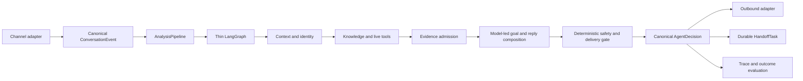

# INHE Customer-Service Copilot Architecture

## Authority

This is the authoritative architecture overview. It describes durable module
ownership and the active delivery direction. Dated acceptance results belong in
evaluation output or historical reports, not in this document.

The system remains a modular monolith. No microservice split, message queue, or
platform-specific Agent fork is currently justified.

## North Star

Build one platform-neutral customer-service Agent that resolves ordinary
customer needs naturally from verified product, order, policy, and media
context; performs approved service actions through tools; and creates a durable
human task when the unresolved part genuinely requires a person.

Quality is measured by customer outcomes:

- correct supported claims;
- completed service actions;
- context continuity across turns;
- low unnecessary-handoff rate;
- zero unsupported high-risk or delivery claims;
- natural, concise, progressive replies; and
- acceptable latency and reliability.

Safety benchmarks and infrastructure checks are necessary constraints. They are
not substitutes for these outcomes.

## Architecture In One Sentence

Use a thin stateful LangGraph runtime around compact context, typed tools,
admitted evidence, one model-first reply owner, and deterministic
safety/delivery control.

LangGraph is not the reasoning engine. The model is not a source of truth. The
knowledge base is not a reply composer.

## Canonical Runtime



The formal customer path is:

```text
canonical turn
-> smallest useful context
-> customer goals
-> identity and tool results
-> admitted evidence plus unresolved claims
-> one customer-facing reply candidate
-> final safety/delivery decision
-> send, assist, or handoff
```

## Layer Ownership

### Channel Adapters

QianNiu, Pinduoduo, JD, and future channels translate native events and
capabilities into canonical contracts. They own platform authentication,
field mapping, outbound formatting, and delivery results. Platform-native
fields may not create branches in Agent reasoning.

Status: planned.

### AnalysisPipeline

`AnalysisPipelineService` is the only formal application path for API, copilot,
replay, and benchmark. It owns stage order, failure isolation, final
persistence, and shadow isolation. HTTP routes own transport and presentation
only.

Status: formal.

### Thin LangGraph Runtime

LangGraph owns state and control flow that benefit from explicit orchestration:

- domain and tool routing;
- bounded retries and timeouts;
- recoverable transitions;
- pause/resume;
- traceable state; and
- choosing reply, clarification, tool, or handoff paths.

It does not own:

- a second evidence registry;
- platform-native fields;
- phrase-specific customer-service rules;
- repeated reply rewriting;
- complete prompt history;
- safety or delivery policy; or
- a second final-response pipeline.

Status: formal but overweight. Reduction is incremental and requires behavior
parity; graph replacement is not a current goal.

### Working Context

The model receives the smallest high-signal context needed for the current
turn:

- current goals and bounded recent turns;
- compact conversation summary when needed;
- resolved product/order identity;
- admitted evidence with provenance;
- unresolved and conflicting claims;
- available tools, service actions, media candidates, and channel capability;
- applicable safety constraints.

Complete traces, unfiltered retrieval stores, all historical answers, private
reasoning, benchmark labels, and entire product catalogs stay outside the
prompt.

`answer_eligibility_context/v1` is a diagnostic projection inside the existing
Minimal Decision Context. It preserves, without recomputing, the current
understanding, conversation-reference, tool-requirement, inference-requirement,
and risk-policy verdicts. Missing owner output remains `unknown`. The projection
is not a router, planner, safety gate, or reply owner, and its
`fast_path_preconditions_complete` field does not change execution.

### Identity, Knowledge, And Tools

External product references resolve to JST/internal identity before scoped facts
are eligible. Product facts use reviewed knowledge. Order, logistics, promotion,
refund, replacement, and other live state use the appropriate read or action
tool. Media references remain candidates until an actual role-compatible block
is delivered.

Knowledge, policy, service action, media, and Answer Memory are distinct roles.
Presence in a context pack does not authorize a claim.

Tool availability and per-turn tool requirement are also distinct. `ToolSpec`
declares whether a registered tool is static knowledge, a live read, or a
side-effect action. The Tool Router and Executor own whether a turn requires
that tool and whether execution completed.

### Evidence Admission

`AdmittedAnswerContextService` is the reusable fact-admission boundary. It owns
review status, direct-answer permission, identity scope, claim compatibility,
placeholder rejection, conflict handling, and provenance-preserving
deduplication.

Formal Evidence Convergence is implemented but disabled in production. Enabling
it in an isolated slice does not change the evidence contract.

Domain Policy Packs are versioned data loaded by `FilePolicyRepository` only
from explicit tenant, store, or catalog metadata. They contain
claim-level risk, inference, direct-fact, and freshness policy, never product
facts, customer text, identities, or reply templates. Deterministic Claim and
Safety owners remain authoritative at runtime. The first
`maternal_child_home` pack is a production candidate only; loading it does not
enable a fast path or alter a formal reply.

### Model-Led Understanding And Reply

The model should understand the current customer goals and organize one natural
reply from compact admitted context. Deterministic code validates schema, tool
authorization, evidence references, safety, and delivery; it should not
reconstruct customer meaning from growing phrase lists.

`ModelFirstAnswerComposerService` is the current candidate reply owner. It is
review-only and disabled by default. It may not retrieve again, establish facts,
execute tools, deliver media, or grant `can_send`.

The long-term formal path has one semantic reply owner. No-evidence, polishing,
semantic-fit, and final-orchestration services may guard or minimally adapt that
reply, but must not become independent answer engines.

### Final Safety And Delivery

Final safety and delivery remain deterministic application responsibilities.
The gate verifies:

- every factual claim has eligible support or allowed bounded inference;
- unresolved high-risk claims remain unresolved;
- service actions correspond to actual tool results;
- media wording matches actual reply blocks;
- channel capability permits delivery; and
- `can_send` reflects the final audited response.

Initial model-first slices remain supervisor-assist only.

### Durable Handoff

A handoff is a task with assignment, reason, SLA, status, acknowledgement, and
audit history. A sentence saying “转人工” is not a handoff implementation.

Status: planned and required before omnichannel automation.

## Active Mainline

ADR 0009 establishes the Agent Core capability mainline. The next deliverable is
one small, real-conversation vertical slice through the existing formal
Pipeline:

1. pinned privacy-safe conversations with usable product/order context;
2. one model-led goal representation;
3. existing identity, retrieval, and tools;
4. existing evidence admission;
5. one model-first reply;
6. existing safety/delivery gate;
7. outcome scoring on correctness, action completion, handoff, naturalness,
   latency, and errors.

This slice is not a production auto-send canary. It exists to prove that the
Agent can answer supported parts, continue a conversation, and escalate only
the unresolved part.

## Frozen Work

Until a failure in the active slice identifies an earlier blocker, do not add:

- supervisor or annotation pages;
- shadow reasoning, memory, vision, or decision modules;
- evaluator/provider qualification frameworks;
- claim taxonomies created to satisfy a small fixture;
- platform-specific Agent rules;
- queues, microservices, or replacement orchestration frameworks.

Existing modules remain available for diagnostics. They do not receive new
scope without a production consumer, promotion metric, rollback boundary, and
real-conversation result.

## Delivery Sequence

### 1. Core Capability Slice

- Establish a comparable baseline on real conversations.
- Ensure required product/order context is present.
- Measure the complete formal Pipeline, not a component in isolation.
- Fix the earliest blocker in context, evidence, tool use, or reply ownership.
- Keep formal knowledge read-only and auto-send disabled.

### 2. Supervisor-Assist Canary

- Expose the qualified candidate to real service staff.
- Record accept, edit, reject, handoff, and handling-time outcomes.
- Promote only when supported-claim correctness and unnecessary handoff improve
  without safety or latency regression.

### 3. Simplify The Runtime

- Remove redundant reply owners after parity tests.
- Collapse Graph nodes that do not own durable state or control flow.
- Retire shadow modules that have no promotion path.

### 4. Omnichannel Operations

- Implement canonical adapters.
- Add durable HandoffTask and supervisor queue.
- Add notifications, SLA, workload, and platform health.

### 5. Low-Risk Automation

- Consider `can_send=true` only for explicitly bounded domains after real
  supervisor-assist evidence, reliable tools, and channel delivery tests.

## Scorecard

Every behavior-affecting change reports:

- real dataset identity and comparable before/after runtime;
- scorable and excluded turns;
- supported-claim correctness and evidence attribution;
- service-action completion;
- unnecessary handoff;
- unsupported high-risk, service, and media claims;
- empty/error/timeout counts;
- reply progression and duplicate replies;
- p50/p95 latency;
- formal knowledge writes; and
- synthetic safety regression.

If real labels are insufficient, report `real_accuracy=null`. Capability metrics
may still be reported, but must not be renamed accuracy.

## Current Reality

- The formal Pipeline, trace/persistence contract, identity boundaries, evidence
  roles, and deterministic safety controls are strong foundations.
- Formal Evidence Convergence and the model-first composer are disabled.
- The canonical answer-eligibility contract is diagnostic only; Fast Path
  remains disabled.
- Real-customer accuracy is not established.
- Existing synthetic benchmark success primarily proves safe fallback.
- Product evidence coverage and provenance remain uneven.
- Reply ownership still overlaps.
- Durable platform adapters and HandoffTask are not implemented.
- Latency is too high for a strong live-service experience.

The project is therefore in **Agent Core capability convergence**, not broad
feature expansion and not production automation.

## Decisions And References

- ADR 0001: one formal AnalysisPipeline.
- ADR 0007: formal evidence convergence.
- ADR 0008: management access boundary.
- ADR 0009: Agent Core capability mainline.
- `docs/langgraph-architecture.md`: runtime-specific boundary.
- `docs/omnichannel-control-plane.md`: platform-neutral operations target.
- `docs/research/mature-customer-service-systems.md`: mature-system patterns.
- `docs/research/evidence-first-llm-decision-loop.md`: evidence/tool/model
  boundary research.
