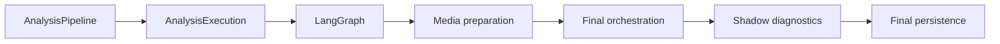

# LangGraph Runtime Boundary

## Document Role

This document is an implementation companion to
`docs/architecture-overview.md`. It does not define the overall product
architecture, evidence policy, or final-delivery contract.

The historical graph grew to roughly forty nodes and a large shared state. That
inventory is useful for migration, but node count is not a target. The desired
direction is a thinner graph around a context-first answering core.

## Why LangGraph Remains

The project needs explicit state and recoverable control flow for:

- multi-turn conversation state;
- product/order identity resolution;
- bounded tool execution and timeout handling;
- product, order, policy, clarification, and handoff routing;
- future human pause/resume and durable platform work;
- reproducible node-level traces.

Removing LangGraph now would not fix the current evidence-selection or context
quality problems. It would instead move the same complexity into custom Python
control flow.

## What LangGraph Must Not Own

- platform-native payload formats;
- duplicate FactType, risk, evidence-role, or delivery registries;
- knowledge eligibility hidden inside routing functions;
- repeated customer-copy rewriting;
- complete retrieved documents or complete traces as model context;
- shadow experiments that mutate formal state;
- the final persistence contract.

## Current Formal Position



`AnalysisPipelineService` owns application stage order. LangGraph owns the
domain execution result before media delivery and final orchestration.
`AnalysisExecutionService` owns trace lifecycle and persistence.

## Target Macro Stages

The target is not an immediate graph rewrite. It is a migration toward these
macro responsibilities:

```text
normalize canonical turn
-> understand requested claims and required identity
-> resolve identity and execute bounded read tools
-> retrieve candidates and admit evidence
-> compose a claim-level candidate reply
-> return graph decision to the final safety/delivery pipeline
```

Individual nodes may remain where they provide distinct retries, branching, or
observability. Pure pass-through nodes, duplicate classifiers, and repeated
reply rewriters are consolidation candidates only after behavior-equivalence
tests exist.

## State Contract Direction

The graph state should reference typed domain objects rather than accumulate
multiple versions of the same decision. The durable target contains:

- canonical turn and compact conversation context;
- requested claims and structured attributes;
- resolved product/order identity;
- tool plan and typed tool results;
- retrieval candidates;
- admitted, rejected, unresolved, and conflicting evidence;
- candidate reply and claim-evidence mapping;
- risk, review, and handoff intent;
- trace identifiers and stage diagnostics.

Delivery blocks, final `can_send`, and persisted final audits belong to the
post-graph Pipeline boundary.

## Context Management Rules

- Pass the model only the current requested claims and their relevant evidence.
- Use a compact conversation summary plus the necessary recent turns.
- Deduplicate facts by stable evidence UID and preserve provenance separately.
- Keep service actions, media candidates, and Answer Memory visibly separated
  from direct facts.
- Do not feed model-private chain-of-thought back into state. Store structured
  claim decisions, evidence references, tool calls, and concise reason codes.
- Measure context token/count budgets and prune before adding model calls.

## Model And Tool Loop

The model may decide which allowed read-only tool to call when the correct tool
cannot be selected reliably before reasoning. Every tool must have a narrow,
typed contract. The application remains authoritative for:

- tool allow/deny policy;
- identity and evidence admission;
- timeout and retry limits;
- side-effect authorization;
- final safety and delivery.

Order mutations, refunds, replacements, compensation, media sending, and other
side effects require explicit capability and human/automation authorization;
they are not generic Agent tools.

## Migration Rules

1. Fix formal evidence convergence before changing graph topology.
2. Introduce one compact Decision Context and claim-level evaluation.
3. Prove a supervisor-only partial-answer vertical slice.
4. Inventory duplicate nodes with runtime traces and ownership mapping.
5. Consolidate one responsibility at a time with API/replay/benchmark parity.
6. Keep final safety and delivery outside the graph.
7. Record any production ownership change in an ADR.

## Verification Expectations

Every graph change must report:

- entry points using the changed graph;
- state fields added, removed, or made authoritative;
- tool calls and timeout behavior;
- evidence and identity effects;
- whether final reply, `can_send`, media, or handoff changed;
- replay and benchmark parity;
- trace and persistence consistency.

For node-level discovery, use the current code in `app/agent/graph.py`,
`app/agent/state.py`, and `app/agent/nodes/`, plus the generated references under
`docs/agent/`. Those references describe implementation; this document defines
the durable runtime boundary.
