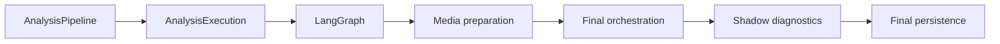

# LangGraph Runtime Boundary

## Active Mainline

ADR 0009 makes one real-conversation Agent Core vertical slice the active
development path. LangGraph remains the state and control-flow runtime; it is
not being replaced and it does not receive new nodes for evaluation,
composition, memory, or evidence policy.

Until that slice proves otherwise, development must improve existing context,
identity/tool use, evidence admission, one model-first reply, and the final
delivery decision. New graph nodes, phrase-specific routing, parallel planners,
and shadow subsystems are frozen.

## Document Role

This document is an implementation companion to
`docs/architecture-overview.md`. It does not define the overall product
architecture, evidence policy, or final-delivery contract.

The historical graph grew to roughly forty nodes and a large shared state. That
inventory is useful for migration, but node count is not a target. The desired
direction is a thinner graph around a context-first answering core.

## Why LangGraph Remains

The project needs explicit state and recoverable control flow for:

- multi-turn conversation state;
- product/order identity resolution;
- bounded tool execution and timeout handling;
- product, order, policy, clarification, and handoff routing;
- future human pause/resume and durable platform work;
- reproducible node-level traces.

Removing LangGraph now would not fix the current evidence-selection or context
quality problems. It would instead move the same complexity into custom Python
control flow.

## What LangGraph Must Not Own

- platform-native payload formats;
- duplicate FactType, risk, evidence-role, or delivery registries;
- knowledge eligibility hidden inside routing functions;
- repeated customer-copy rewriting;
- complete retrieved documents or complete traces as model context;
- shadow experiments that mutate formal state;
- the final persistence contract.

## Current Formal Position



`AnalysisPipelineService` owns application stage order. LangGraph owns the
domain execution result before media delivery and final orchestration.
`AnalysisExecutionService` owns trace lifecycle and persistence.

## Target Macro Stages

The target is not an immediate graph rewrite. It is a migration toward these
macro responsibilities:

```text
normalize canonical turn
-> understand requested claims and required identity
-> resolve identity and execute bounded read tools
-> retrieve candidates and admit evidence
-> compose a claim-level candidate reply
-> return graph decision to the final safety/delivery pipeline
```

Individual nodes may remain where they provide distinct retries, branching, or
observability. Pure pass-through nodes, duplicate classifiers, and repeated
reply rewriters are consolidation candidates only after behavior-equivalence
tests exist.

## State Contract Direction

The graph state should reference typed domain objects rather than accumulate
multiple versions of the same decision. The durable target contains:

- canonical turn and compact conversation context;
- requested claims and structured attributes;
- resolved product/order identity;
- tool plan and typed tool results;
- retrieval candidates;
- admitted, rejected, unresolved, and conflicting evidence;
- candidate reply and claim-evidence mapping;
- risk, review, and handoff intent;
- trace identifiers and stage diagnostics.

Delivery blocks, final `can_send`, and persisted final audits belong to the
post-graph Pipeline boundary.

## Context Management Rules

- Pass the model only the current requested claims and their relevant evidence.
- Use a compact conversation summary plus the necessary recent turns.
- Deduplicate facts by stable evidence UID and preserve provenance separately.
- Keep service actions, media candidates, and Answer Memory visibly separated
  from direct facts.
- Do not feed model-private chain-of-thought back into state. Store structured
  claim decisions, evidence references, tool calls, and concise reason codes.
- Measure context token/count budgets and prune before adding model calls.
- Normalize every incoming conversation into role-aware canonical turns before
  graph understanding. A current buyer message is a separate input, not a
  duplicate history turn.
- Evaluation callers reject malformed turn structures before graph execution;
  ordinary legacy callers retain an explicit degraded-context diagnostic.
- Model-led supervisor candidates may consume compact admitted context only;
  they cannot add facts, alter formal delivery, or persist private reasoning.

## Canonical Answer Eligibility Projection

The existing evidence-building path may attach
`answer-eligibility-context/v1` to the Minimal Decision Context. LangGraph does
not derive its fields and gains no node:

- Turn Understanding owns `goal_understanding_status`.
- Canonical context resolution owns `conversation_reference_status`; until a
  reliable resolution result exists, the status is `unknown`.
- Tool Router and Executor own `tool_requirement_status`, using explicit
  `ToolSpec.freshness_class` metadata.
- Claim Resolution owns `inference_requirement_status` and each claim's
  `support_basis`.
- a versioned Domain Policy Pack supplies policy data, while deterministic
  Claim/Safety code owns `risk_policy_status`.

Minimal Decision Context only projects these results. It may not infer a
missing status from customer text, an available-tool list, or model risk hints.
The fast-path completeness field is observability only; all requests continue
through the existing graph and final Pipeline.

A fast-path-eligible goal must be a canonical `customer_goal` with a stable
goal reference, claim type, valid current-message source span, and a valid Turn
Understanding verdict. A `query_fact_type` compatibility fallback is marked
degraded and may support legacy retrieval only. Dependencies, service actions,
and contextual constraints do not increase the customer-goal count.

The Pipeline removes public `turn_understanding` in full before graph
execution, so non-authoritative diagnostics cannot influence eligibility,
evidence, or reply control. The existing classifier then
creates a fresh owner result and always replaces `requested_claims`,
`customer_goals`, status, and diagnostics; an owner result without a customer
goal writes an empty claim list. Eligibility accepts only owner-stamped claims
whose exact span is in the current normalized buyer message and whose SHA-256
matches a deterministic recomputation of that slice.

The Pipeline removes the reserved eligibility owner key from public
`copilot_context` and may restore it only from its separate schema-checked
internal request field. Canonical conversation reference and Domain Pack
selection therefore cannot be asserted by an API caller. Tool freshness stays
inside the deterministic registry and eligibility projection; planner metadata
keeps its prior `name`, `description`, and `input_schema` contract.

## Model And Tool Loop

The model may decide which allowed read-only tool to call when the correct tool
cannot be selected reliably before reasoning. Every tool must have a narrow,
typed contract. The application remains authoritative for:

- tool allow/deny policy;
- identity and evidence admission;
- timeout and retry limits;
- side-effect authorization;
- final safety and delivery.

Order mutations, refunds, replacements, compensation, media sending, and other
side effects require explicit capability and human/automation authorization;
they are not generic Agent tools.

## Migration Rules

1. Fix formal evidence convergence before changing graph topology.
2. Introduce one compact Decision Context and claim-level evaluation.
3. Prove a supervisor-only partial-answer vertical slice.
4. Inventory duplicate nodes with runtime traces and ownership mapping.
5. Consolidate one responsibility at a time with API/replay/benchmark parity.
6. Keep final safety and delivery outside the graph.
7. Record any production ownership change in an ADR.

## Verification Expectations

Every graph change must report:

- entry points using the changed graph;
- state fields added, removed, or made authoritative;
- tool calls and timeout behavior;
- evidence and identity effects;
- whether final reply, `can_send`, media, or handoff changed;
- replay and benchmark parity;
- trace and persistence consistency.

For node-level discovery, use the current code in `app/agent/graph.py`,
`app/agent/state.py`, and `app/agent/nodes/`, plus the generated references under
`docs/agent/`. Those references describe implementation; this document defines
the durable runtime boundary.

## Canonical Context Integrity

The graph receives current customer text once plus structured prior turns. It
does not accept a flattened transcript as the current question. Formal turns
retain local operational text; external-model calls use a separate privacy
projection. Strict evaluation rejects missing, duplicate, and descending turn
indexes before Graph execution. Online adapters may repair an index only while
 recording the original value and reason in the canonical-context diagnostic.

Evaluation-source detection is shared by the Sidecar route and Pipeline. Known
benchmark, replay, real-accuracy, and Tier D sources are strict even when a
caller omits a flag; malformed history cannot become a valid empty context.
For online callers, Pipeline revalidation records its own result but preserves
the earliest upstream degraded or invalid reason.
LangGraph receives only the canonical result. It does not own redaction policy,
runtime build identity, or Tier D scoring.
The Tier D grader has two separate states. A configured independent candidate
can be probed through its strict schema with positive and denial/deflection
examples, while only an explicitly approved grader can score a live Tier D
run. The qualification harness records provider behavior separately from local
schema rejection checks; it never promotes a candidate by editing configuration.
Before a Tier D trial, the runner compares three safe Provider Identities
(`host_fingerprint + model`): formal Agent, buyer simulator, and transcript
grader. Any missing identity or pairwise collision stops the run before the
formal Pipeline is called. The host fingerprint is derived from canonical
origin only: scheme, lower-case hostname, and effective port. Endpoint paths,
queries, fragments, and userinfo neither appear in reports nor create a new
identity. This is evaluation orchestration, not a LangGraph responsibility.

Phase 0.8B keeps the same boundary. The turn evidence funnel is a read-only
projection of the existing admitted context for evaluation reports. Dialogue
State, controlled Action Policy, and counterfactual preview are paused and are
not attached by `AnalysisPipelineService`. LangGraph gains no node, registry,
retrieval, action execution, or delivery authority. Any future activation would
require a qualified provider, a separate decision record, and entry-point parity
evidence.

## Phase 0.9A Model-First Composition Boundary

Phase 0.9A does not add a graph node. `AnalysisPipelineService` invokes the
opt-in answer composer after the existing formal evidence-convergence stage and
before final orchestration. The composer reads the existing Minimal Decision
Context and returns one candidate plus evidence references and unresolved claim
types. It cannot admit evidence, invoke side-effecting tools, attach media, or
change `can_send`.

Final audit, semantic fit, media validation, and the review-only delivery
boundary remain deterministic application services outside LangGraph. The
candidate path skips later semantic rewriting so a supported clause cannot be
silently replaced by a generic handoff. Production flags remain off; the
candidate result is development evidence only.
