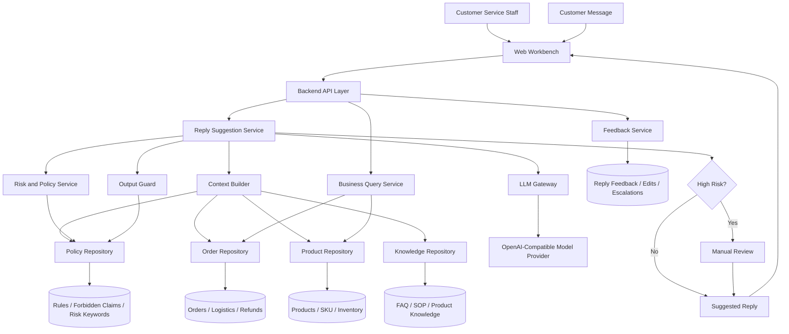
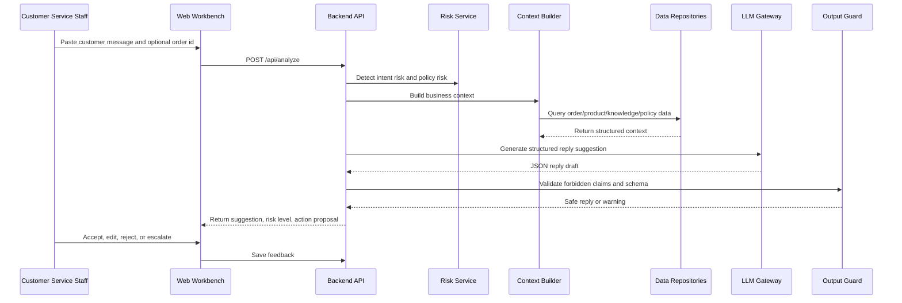

# Customer Copilot Architecture

## 1. Current Situation

The project can move forward even without a complete conversation corpus, product catalog, or knowledge base. At this stage, the priority is not to train a big knowledge system. The priority is to define stable boundaries:

- How customer messages enter the system.
- How risk and policy rules are checked.
- How order, logistics, refund, product, and knowledge data are queried.
- How the LLM is allowed to generate a reply.
- How humans review high-risk cases.
- How feedback is stored for future optimization.

The current implementation is a useful prototype:

- `web.py`: Flask API and web page.
- `main.py`: command-line interface.
- `agent.py`: LLM prompt, context building, risk detection, JSON parsing.
- `data_index.py`: local JSON data index.
- `config.py`: model config, data path, policy keywords.

The next step should be a modular monolith, not microservices.

## 2. What Can Be Built First

### Phase 0: Foundation Without Full Data

Build these first:

1. Conversation input and reply draft flow.
2. Risk keyword and forbidden-claim rules.
3. Structured LLM response schema.
4. Mock product/order/knowledge repositories.
5. Manual-review flag for high-risk cases.
6. Feedback capture: accepted, edited, rejected, escalated.
7. Admin-editable rule files.

This gives the product a working loop before the data is complete.

### Phase 1: Small Sample Knowledge Base

Use 20-50 manually written entries first:

- Shipping policy.
- Refund and return policy.
- Common product material answers.
- Installation and usage answers.
- Complaint handling templates.
- Logistics abnormal handling.
- Missing item or wrong item handling.

The goal is not coverage. The goal is to validate retrieval, prompt assembly, and reply quality.

### Phase 2: Product and Order Integration

After the reply flow is stable:

- Replace local JSON with real ERP/Jushuitan/API/database adapters.
- Add product attributes and SKU FAQ.
- Add order status, logistics status, refund status, after-sales status.
- Keep the service interfaces unchanged.

### Phase 3: Operational System

Once used by real customer service staff:

- Track reply acceptance rate.
- Track manual edit patterns.
- Track high-risk categories.
- Build rule management.
- Build knowledge gap reports.
- Add role-based access control.

## 3. Target Architecture



## 4. Runtime Flow



## 5. Recommended Code Structure

```text
copilot/
  app/
    main.py
    api/
      analyze_routes.py
      order_routes.py
      feedback_routes.py
    services/
      reply_service.py
      context_builder.py
      risk_service.py
      output_guard.py
      feedback_service.py
    llm/
      client.py
      prompts.py
      schemas.py
    repositories/
      base.py
      json_order_repository.py
      json_product_repository.py
      file_knowledge_repository.py
      file_policy_repository.py
    models/
      reply.py
      order.py
      product.py
      knowledge.py
    config.py
  rules/
    forbidden_claims.yaml
    risk_keywords.yaml
    reply_policies.yaml
  knowledge/
    shipping.md
    refund.md
    product_common.md
    complaint.md
  data/
    sample_orders.json
    sample_products.json
  web/
    templates/
    static/
  tests/
    test_risk_service.py
    test_output_guard.py
    test_reply_service.py
  run_web.py
  run_cli.py
```

## 6. Module Responsibilities

| Module | Responsibility | Can Build Now? |
| --- | --- | --- |
| Web Workbench | Input message, show draft, copy reply, save feedback | Yes |
| API Layer | Stable HTTP endpoints | Yes |
| Reply Service | Main orchestration | Yes |
| Risk Service | Keyword, scenario, escalation rules | Yes |
| Output Guard | Block forbidden claims and unsafe promises | Yes |
| Context Builder | Merge order/product/knowledge/policy context | Yes |
| LLM Gateway | Isolate model provider and retry logic | Yes |
| Repository Layer | Hide whether data comes from JSON, database, or API | Yes |
| Knowledge Repository | Start with Markdown files | Yes |
| Feedback Service | Store accepted/edited/rejected replies | Yes |
| Real Data Integration | Connect real order/product/ERP systems | Later |
| Admin Rule Console | Manage rules in UI | Later |

## 7. Minimum Viable Product

The first usable version should support:

- Customer message analysis.
- Optional order number lookup.
- Risk level: low, medium, high.
- Suggested reply.
- Policy warnings.
- Suggested next action.
- Copy reply.
- Save whether the reply was used.
- Mark high-risk messages for human review.

This is enough to test the product with customer service staff before the knowledge base is complete.

## 8. Key Design Decisions

### Use a Modular Monolith First

The system is still early. A modular monolith keeps deployment simple while preserving future boundaries.

### Repositories Before Real Data

Define repository interfaces now. Use JSON and Markdown first. Replace them later with database or API adapters.

### Rules Before Knowledge Scale

Risk and compliance rules matter earlier than a large knowledge base. A small, accurate rule set is more valuable than a large but unverified corpus.

### Human Review Is a Product Feature

The system should not pretend every answer is safe. High-risk complaints, refunds, compensation, legal threats, and platform complaints should be escalated.

## 9. Near-Term Build Order

1. Move API key and paths to environment variables.
2. Add structured schemas for LLM output.
3. Split `agent.py` into reply service, risk service, context builder, and LLM client.
4. Add rule files under `rules/`.
5. Add small Markdown knowledge files under `knowledge/`.
6. Add feedback storage.
7. Add tests for risk detection and forbidden-claim blocking.
8. Improve the web UI around review, copy, edit, and feedback.

